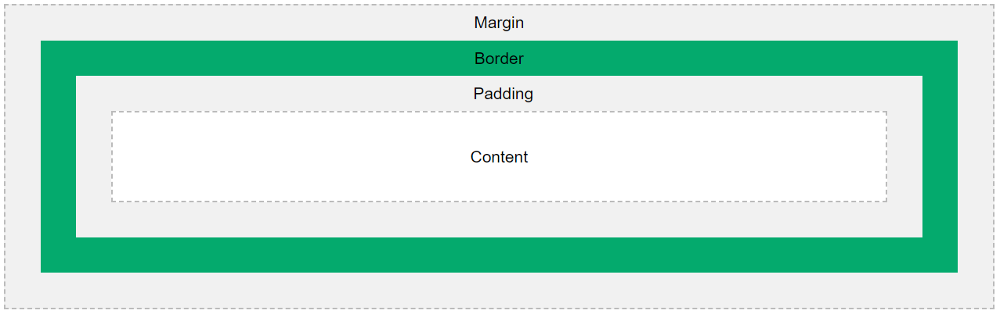
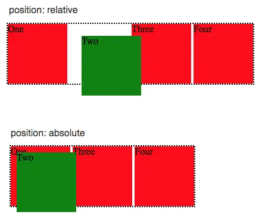

# All important Interview Questions and Answers

## Table of Contents

- [HTML](#html)
- [CSS](#css)
- [JavaScript](#javascript)
- [Angular](#angular)
- [NodeJs](#nodejs)
- [MySQL](#mysql)
- [JavaScript basic programs](#javascript-basic-programs)

<!-- Start HTML -->

## **HTML**

### Q 1. What is HTML?

HTML stands for **_HyperText Markup Language_**. It is a standard text formatting language used for developing web pages released in 1993. HTML is a language that is interpreted by the browser and it tells the browser what to display and how to display.

<div align="right"><b><a href="#table-of-contents">↥ Back to top</a></b></div>

### Q 2. What are Tags, Elements and Attributes?

- **Tags:** Tags are the starting and ending parts of an HTML element. They begin with < symbol and end with > symbol. Whatever is written inside < and > are called tags.\
  `<p></p>`
- **Elements:** Elements are made up of tags along with the content they enclose. An element consists of the opening tag, the content, and the closing tag.\
  `<p>Hello, world!</p>`
- **Attributes:** Attributes provide additional information about an element. They are placed within the opening tag of an element and consist of a name-value pair.\
  `<a href="https://www.example.com">Visit Example</a>`

<div align="right"><b><a href="#table-of-contents">↥ Back to top</a></b></div>

### Q 3. What are Semantic Elements?

Semantic HTML elements are those that clearly describe their meaning in a human- and machine-readable way

- `<header>`
- `<nav>`
- `<footer>`
- `<section>`
- `<article>`

<div align="right"><b><a href="#table-of-contents">↥ Back to top</a></b></div>

### Q 4. What are HTML APIs?

- **Geolocation -** It is used to get the geographical position of a user\
- **Drag and Drop -** In HTML, any element can be dragged and dropped.
- **Web Storage -** With web storage, web applications can store data locally within the user's browser.\
  `LocalStorage` and `SessionStorage`
- **Web Workers -** A web worker is a JavaScript running in the background, without affecting the performance of the page.
- **SSE -** Server-Sent Events (SSE) allow a web page to get updates from a server.

<div align="right"><b><a href="#table-of-contents">↥ Back to top</a></b></div>

### Q 5. What is the difference between Cookie, Local storage and Session storage?

|                | Cookie                 | Local storage | Session storage      |
| -------------- | ---------------------- | ------------- | -------------------- |
| **Capacity**   | 4KB                    | 10MB          | 5MB                  |
| **Expiration** | Manually set           | Never         | On tab/browser close |
| **Read**       | Both Client and Server | Client        | Client               |

<div align="right"><b><a href="#table-of-contents">↥ Back to top</a></b></div>

<!-- Start CSS -->

## **CSS**

### Q 1. What is CSS?

CSS stands for **_Cascading Style Sheets_**. It is a style sheet language, which is used to describe the look and formatting of a document written in **_HTML_**.

<div align="right"><b><a href="#table-of-contents">↥ Back to top</a></b></div>

### Q 2. What is the Box model in CSS?

The CSS box model is a container that contains multiple properties like content, padding, border and margin. It is used to create the design and layout of web pages.



<div align="right"><b><a href="#table-of-contents">↥ Back to top</a></b></div>

### Q 3. What are Pseudo class and Pseudo element?

- **Pseudo class** is used to define the special state of an element like when the user is hovering over the link.
  - :hover
  - :active
  - :focus
  - ```css
    a: hover {
      color: #FFOOFF;
    }
    ```
- **Pseudo element** is used to add style to specified parts of an element. Example: Using style before or after an element
  - ::before
  - ::after
  - ::first-letter
  - ```css
    p::first-line {
      color: #ffOOOO;
    }
    ```

<div align="right"><b><a href="#table-of-contents">↥ Back to top</a></b></div>

### Q 4. What is a z-index?

It is used to define the order of elements if they overlap with each other.\
Syntax

> _**z-index:** auto | number | initial | inherit;_

- auto: The stack order is equal to that of the parent(default).
- number: The stack order depends on the number.
- initial: Sets the property to its default value.
- inherit: Inherits the property from the parent element.


<div align="right"><b><a href="#table-of-contents">↥ Back to top</a></b></div>

### Q 5. Explain CSS Absolute and Relative position property?

position: relative places an element relative to its current position without changing the layout around it, whereas position: absolute places an element relative to its parent’s position and changing the layout around it

- **Absolute:** Position absolute places an element relative to its parent’s position and changing the layout around it.
- **Relative:** Position relative places an element relative to its current position without changing the layout around it.



<div align="right"><b><a href="#table-of-contents">↥ Back to top</a></b></div>

### Q 6. How to center align a div inside another div?

```html
<div class="”outer”">
  <div class="”inner”">your content</div>
</div>
```

```css
/* First method */
.outer {
  display: flex;
  justify-content: center;
  align-items: center;
}

/* Second method */
.outer {
  display: grid;
  place-content: center;
}
```

<div align="right"><b><a href="#table-of-contents">↥ Back to top</a></b></div>

### Q 7. How can we make our website responsive using CSS?

Media query is used to create a responsive web design. It means that the view of a web page differs from system to system based on screen or media types.

- Width and height of the viewport
- Width and height of the device
- Orientation
- Resolution

Syntax

```css
/* @media not|only mediatype and (mediafeature and|or|not mediafeature) */
@media only screen and (max-width: 600px) {
  /* CSS-Code; */
}
```

<div align="right"><b><a href="#table-of-contents">↥ Back to top</a></b></div>

### Q 8. How to change the color for even and odd list items?

```css
/* Change the background color odd in list ex. 1,3,5,7  */
tr:nth-child(odd) {
  background-color: lightblue;
}

/* Change the background color even in list ex. 2,4,6,8  */
tr:nth-child(even) {
  background-color: lightgreen;
}

/* Change the background color to specific item in a list  */
tr:nth-child(4) {
  background-color: lightcoral;
}
```

<div align="right"><b><a href="#table-of-contents">↥ Back to top</a></b></div>

### Q 9. What is CSS flexbox, and what are its properties?

It is also called a flexible box model. It is basically a layout model that provides an easy and clean way to arrange items within a container. Flexbox is different from the block model which is vertically biased and the inline which is horizontally biased. Flexbox was created for small-scale layouts and there’s another standard called grids which are geared more towards larger-scale layouts, It works similar to the way to Twitter bootstrap grid system works. Flexbox is responsive and mobile-friendly. To start with flexbox firstly create a flex container. To create a flex container set the display property to flex.

**Flex Properties:**

- **flex-direction:** row, column, row-reverse, column-reverse
- **flex-wrap:** wrap, nowrap, wrap-reverse
- **flex-flow:** This property is used for setting both flex-direction and flex-wrap properties in one statement
- **justify-content** center, flex-start, flex-end, space-around, space-between
- **align-items** This is used for aligning flex items
- **align-content** This is used for aligning the flex lines

<div align="right"><b><a href="#table-of-contents">↥ Back to top</a></b></div>

### Q 10. What is CSS Grid?

It is a CSS property that offers a grid-based layout system, with rows and columns, making it easier to design web pages without floats and positioning.

Syntax:

> grid:none|grid-template-rows / grid-template-columns|grid-template-areas|\
> grid-template-rows / [grid-auto-flow] grid-auto-columns|[grid-auto-flow]
> grid-auto-rows / grid-template-columns|initial|inherit;

<div align="right"><b><a href="#table-of-contents">↥ Back to top</a></b></div>

##

<!-- Start JavaScript -->

## **JavaScript**

### Q 1. What is Javascript?

JavaScript, created by **Brendan Eich** in **1995**. JavaScript is the most popular scripting language for the Web. It is easy to learn, lightweight, cross-platform, single-threaded, and interpreted compiled language. It is widely used for web development, both on the client side and server side.

<div align="right"><b><a href="#table-of-contents">↥ Back to top</a></b></div>

### Q 2. What are the data types in JavaScript?

JavaScript is a dynamically typed (also called loosely typed) scripting language. In JavaScript, variables can receive different data types over time.

**1. Primitive Data Type:**

1. **Number:** Represents numeric values, including integers and floating-point numbers.
2. **String:** Represents textual data enclosed in single quotes ('') or double quotes ("").
3. **Boolean:** Represents a logical value, either true or false.
4. **Undefined:** Represents a variable that has been declared but not assigned a value.
5. **Null:** Represents the intentional absence of any value.
6. **Symbol (ES6):** Represents a unique and immutable value that may be used as the key of an object property.
7. **BigInt:** BigInt is a built-in object in JavaScript that provides a way to represent whole numbers larger than 253-1.

**2. Non Primitive Data Type:**

1. **Object:** Represents a collection of key-value pairs where keys are strings (or symbols) and values can be of any data type, including other objects.
2. **Array:** Represents a collection of elements, usually of the same data type, indexed by non-negative integers.

**3. Special Data Type:**

1. **Function:** Functions are treated as first-class citizens, meaning they can be assigned to variables, passed as arguments to other functions, and returned from other functions.

<div align="right"><b><a href="#table-of-contents">↥ Back to top</a></b></div>

### Q 3. What are difference between var, let and const?

| keyword    | var               | let              | const            |
| ---------- | ----------------- | ---------------- | ---------------- |
| Scope      | Global & Function | Function & Block | Function & Block |
| Reassigned | Yes               | Yes              | No               |
| Redeclare  | Yes               | No               | No               |
| Hoisted    | Yes               | No               | No               |

### Q 4. What is hoisting?

Hoisting is the default behaviour of javascript where all the variable and function declarations are moved on top during the compilation.

> _**NOTE:** It's important to understand that only the declarations are **hoisted**, not the initializations or assignments._\
> _To avoid hoisting, you can run javascript in strict mode by using `use strict` on top of the code_

### Q 5. What is closure?

In JavaScript, returning a function from another function means returning function along with its scope. This allows the function to retain access to memory, which can store live data between executions. This combination of the function and its scope chain is called closure.

```javascript
function outer() {
  let counter = 0;

  return function inner() {
    counter++;
    console.log(counter);
  };
}

const fn = outer();
fn(); // 1
fn(); // 2
fn(); // 3
```

<div align="right"><b><a href="#table-of-contents">↥ Back to top</a></b></div>

### Q 6. What is passed by value and passed by reference?

In JavaScript, primitive data types are passed by value and non-primitive data types are passed by reference.

1. **Passed by Value:** When a primitive data type (such as numbers, strings, booleans, null, or undefined) is passed to a function, it is passed by value. This means that a copy of the value is passed to the function, and any changes made to the parameter inside the function do not affect the original variable outside the function.

```javascript
function increment(x) {
  x++;
  return x;
}

let num = 5;
console.log(increment(num)); // Output: 6
console.log(num); // Output: 5 (original variable remains unchanged)
```

2. **Passed by Reference:** When an object (including arrays and functions) is passed to a function, it is passed by reference. This means that a reference to the original object is passed to the function, rather than a copy of the object itself. Therefore, changes made to the object's properties or elements inside the function will affect the original object outside the function.

```javascript
function addName(person) {
  person.name = "John";
  return person;
}

let user = { name: "Alice" };
console.log(addName(user)); // Output: { name: 'John' }
console.log(user); // Output: { name: 'John' } (original object is modified)
```

<div align="right"><b><a href="#table-of-contents">↥ Back to top</a></b></div>

### Q 7. Explain call(), apply() and, bind() methods?

`call()`, `apply()`, and `bind()` are methods in JavaScript, which is used to invoke a function.

1. **call():** This method invokes a function with a given `this` value and takes arguments as comma separated.

```javascript
var employee1 = { firstName: "John", lastName: "Rodson" };
var employee2 = { firstName: "Jimmy", lastName: "Baily" };

function invite(greeting1, greeting2) {
  console.log(
    greeting1 + " " + this.firstName + " " + this.lastName + ", " + greeting2
  );
}

invite.call(employee1, "Hello", "How are you?"); // Hello John Rodson, How are you?
invite.call(employee2, "Hello", "How are you?"); // Hello Jimmy Baily, How are you?
```

2. **apply():** This method invokes a function with a given `this` value and takes arguments as an array.

```javascript
var employee1 = { firstName: "John", lastName: "Rodson" };
var employee2 = { firstName: "Jimmy", lastName: "Baily" };

function invite(greeting1, greeting2) {
  console.log(
    greeting1 + " " + this.firstName + " " + this.lastName + ", " + greeting2
  );
}

invite.apply(employee1, ["Hello", "How are you?"]); // Hello John Rodson, How are you?
invite.apply(employee2, ["Hello", "How are you?"]); // Hello Jimmy Baily, How are you?
```

3. **bind():** Returns a new function and takes arguments as comma separated.

```javascript
var employee1 = { firstName: "John", lastName: "Rodson" };
var employee2 = { firstName: "Jimmy", lastName: "Baily" };

function invite(greeting1, greeting2) {
  console.log(
    greeting1 + " " + this.firstName + " " + this.lastName + ", " + greeting2
  );
}

var inviteEmployee1 = invite.bind(employee1);
var inviteEmployee2 = invite.bind(employee2);
inviteEmployee1("Hello", "How are you?"); // Hello John Rodson, How are you?
inviteEmployee2("Hello", "How are you?"); // Hello Jimmy Baily, How are you?
```

<div align="right"><b><a href="#table-of-contents">↥ Back to top</a></b></div>

### Q 8. What is currying ?

Currying is the process of taking a function with multiple arguments and turning it into a sequence of functions each with only a single argument.

In other words, when a function, instead of taking all arguments at one time, takes the first one and return a new function that takes the second one and returns a new function which takes the third one, and so forth, until all arguments have been fulfilled.

```javascript
// Normal function
const add = (a, b, c) => {
  return a + b + c;
};
console.log(add(10, 10, 10)); // 30

// Currying function
const addCurry = (a) => {
  return (b) => {
    return (c) => {
      return a + b + c;
    };
  };
};
console.log(addCurry(20)(20)(20)); // 60
```

<div align="right"><b><a href="#table-of-contents">↥ Back to top</a></b></div>

### Q 9. What is the rest parameter and spread operator?

The rest parameter and spread operator are two features introduced in ECMAScript 6 (ES6) that enhance the functionality of JavaScript functions and arrays, respectively.

> _**NOTE:** Rest parameter should always be used at the last parameter of a function._

1. **Rest Parameter (`...`):** Rest parameter is an improved way to handle function parameters which allows us to represent an indefinite number of arguments as an array.\
    _**Example:**_
   ```javascript
   function sum(...numbers) {
     return numbers.reduce((total, num) => total + num, 0);
   }
   console.log(sum(1, 2, 3, 4, 5)); // Output: 15
   ```
2. **Spread Operator (...):** Spread operator allows iterables( arrays / objects / strings ) to be expanded into single arguments/elements.\
   _**Example:**_

   ```javascript
   function sum(x, y, z) {
     return x + y + z;
   }
   const numbers = [10, 20, 30];

   // Using Apply (ES5)
   console.log(sum.apply(null, numbers)); // 60

   // Using Spread Operator
   console.log(sum(...numbers)); // 60
   ```

   1. **Copying an array:**

      ```javascript
      let fruits = ["Apple", "Orange", "Banana"];
      let newFruitArray = [...fruits];

      console.log(newFruitArray); // Output: ['Apple', 'Orange', 'Banana']
      ```

   2. **Concatenating arrays:**

      ```javascript
      let arr1 = ["A", "B", "C"];
      let arr2 = ["X", "Y", "Z"];

      let result = [...arr1, ...arr2];

      console.log(result); // Output: ['A', 'B', 'C', 'X', 'Y', 'Z']
      ```

   3. **Spread syntax for object literals**

      ```javascript
      const obj1 = { id: 101, name: 'Rajiv Sandal' }
      const obj2 = { age: 35, country: 'INDIA' }

      const employee = { ...obj1, ...obj2 }

      console.log(employee);

      // Output
      {
        "id": 101,
        "name": "Rajiv Sandal",
        "age": 35,
        "country": "INDIA"
      }
      ```

<div align="right"><b><a href="#table-of-contents">↥ Back to top</a></b></div>

### Q 10. What are Sets and WeakSet?

1.  **Sets:** Sets are a new object type with ES6 (ES2015) that allow to create collections of unique values. The values in a set can be either simple primitives like strings or integers, but more complex object types like object literals or arrays can also be part of a set.\
    _**Example:**_

    ```javascript
    let numbers = new Set([10, 20, 20, 30, 40, 50]);

        console.log(numbers); Set(5) { 10, 20, 30, 40, 50 }
        console.log(typeof numbers); // Object
    ```

2.  **WeakSet:** Just like Set, WeakSet is also a collection of unique and ordered elements with some key differences. Weakset contains only objects and no other type. Unlike Set, WeakSet only has three methods, add() , delete() and has().\
    _**Example:**_

    ```javascript
    const newSet = new Set([4, 5, 6, 7]);
    console.log(newSet); // Outputs Set {4,5,6,7}

    const newSet2 = new WeakSet([3, 4, 5]); //Throws an error

    let obj1 = { message: "Hello world" };
    const newSet3 = new WeakSet([obj1]);
    console.log(newSet3.has(obj1)); // true
    ```

<div align="right"><b><a href="#table-of-contents">↥ Back to top</a></b></div>

### Q 11. What are Map and WeakMap?

1. **Map:** In javascript, Map is used to store key-value pairs. The key-value pairs can be of both primitive and non-primitive types. WeakMap is similar to Map with key differences.

   - The keys and values in weakmap should always be an object.
   - If there are no references to the object, the object will be garbage collected.

     _**Example:**_

     ```javascript
     const map1 = new Map();
     map1.set("Value", 1);

     const map2 = new WeakMap();
     map2.set("Value", 2.3); // Throws an error

     let obj = { name: "Vivek" };
     const map3 = new WeakMap();
     map3.set(obj, { age: 23 });
     ```

2. **WeakMap:** The WeakMap object is a collection of key/value pairs in which the keys are weakly referenced. In this case, keys must be objects and the values can be arbitrary values. WeakMap accepts only objects but not any primitive values (strings, numbers).

   _**Example:**_

   ```javascript
   // WeakMap()
   function Obj() {
     this.val = new Array(10).join("---");
   }

   window.obj = new Obj();
   var map = new WeakMap();
   console.log(window.obj); // {val: "-----------------", constructor: Object}
   map.set(window.obj, 20); // WeakMap {Obj => 20}
   console.log(map);
   ```

**Difference between Map and WeakMap:**

1. A WeakMap accepts only objects as keys whereas a Map, in addition to objects, accepts primitive datatype such as strings, numbers etc.
2. WeakMap objects doesn't avert garbage collection if there are no references to the object which is acting like a key. Therefore there is no method to retrieve keys in WeakMap, whereas in Map there are methods such as Map.prototype.keys() to get the keys.
3. There is no size property exists in WeakMap.

<div align="right"><b><a href="#table-of-contents">↥ Back to top</a></b></div>

### Q 12. What is destructing?

Destructuring in JavaScript is a convenient way to extract multiple values from arrays or objects and assign them to variables using a concise syntax. It allows you to "unpack" values from data structures like arrays and objects into separate variables, making it easier to work with complex data in a more expressive and succinct manner.

_**Example:**_

```javascript
const person = { name: "John", age: 30 };
const { name, age } = person;
console.log(name); // Output: "John"
console.log(age); // Output: 30
```

<div align="right"><b><a href="#table-of-contents">↥ Back to top</a></b></div>

### Q 13. What are generators?

A generator is a function that can stop midway and then continue from where it stopped. In short, a generator appears to be a function but it behaves like an `iterator`.

_**Example:**_

```javascript
function* generator(num) {
  yield num + 10;
  yield num + 20;
  yield num + 30;
}
let gen = generator(10);

console.log(gen.next().value); // 20
console.log(gen.next().value); // 30
console.log(gen.next().value); // 40
```

<div align="right"><b><a href="#table-of-contents">↥ Back to top</a></b></div>

### Q 14. What is the difference between null and undefined?

| Null                                                                                | Undefined                                                                                      |
| ----------------------------------------------------------------------------------- | ---------------------------------------------------------------------------------------------- |
| Type of null is object                                                              | Type of undefined is undefined                                                                 |
| Undefined means a variable has been declared but has yet not been assigned a value. | Null is an assignment value. It can be assigned to a variable as a representation of no value. |
| It is a global property.                                                            | It is not a global property.                                                                   |

<div align="right"><b><a href="#table-of-contents">↥ Back to top</a></b></div>

### Q 15. What is the difference between window and document?

| Window                                                                        | Document                                                                                      |
| ----------------------------------------------------------------------------- | --------------------------------------------------------------------------------------------- |
| It is the root level element in any web page                                  | It is the direct child of the window object. This is also known as Document Object Model(DOM) |
| It has methods like alert(), confirm() and properties like document, location | It provides methods like getElementById, getElementsByTagName, createElement etc              |

<div align="right"><b><a href="#table-of-contents">↥ Back to top</a></b></div>

### Q 16. What is the difference between == and === operators?

In JavaScript, the `==` and `===` operators are used for comparison and `===` checks both the values and the types, and only returns true if both are the same.

_**Example:**_

```javascript
0 == false // true
0 === false // false
1 == "1" // true
1 === "1" // false
null == undefined // true
null === undefined // false
"0" == false // true
"0" === false // false
[] === [] // false, refer different objects in memory
{} === {} // false, refer different objects in memory
```

<div align="right"><b><a href="#table-of-contents">↥ Back to top</a></b></div>

### Q 17. What are typeOf, delete, void, and ternary operators?

1. **`typeof` Operator:** This is used to determine the type of a value or expression
   _**Example:**_

   ```javascript
   typeof 42; // Returns "number"
   typeof "hello"; // Returns "string"
   typeof true; // Returns "boolean"
   ```

2. **`delete` Operator:** This operator is used to delete a property from an object.
   _**Example:**_

   ```javascript
   const obj = { a: 1, b: 2 };
   delete obj.a; // Deletes the property "a" from the object
   ```

3. **`void` Operator:** This operator evaluates an expression and returns undefined. It's often used to create a URL with a JavaScript "void" link, where clicking the link does nothing.
   _**Example:**_

   ```html
   <a href="javascript:void(0)">Click me</a>
   ```

4. **Ternary (`? :`) Operator:** The ternary operator is a conditional operator that evaluates a condition and returns one of two expressions based on whether the condition is true or false.
   _**Example:**_

   ```javascript
   const age = 20;
   const status = age >= 18 ? "adult" : "minor";
   console.log(status); // Output depends on the value of age
   ```

<div align="right"><b><a href="#table-of-contents">↥ Back to top</a></b></div>

### Q 18. What is isNaN?

The isNaN() function determines whether a value is NaN ( Not a Number ) or not. This function returns true if the value equates to NaN. The isNaN() method converts the value to a number before testing it.

_**Example:**_

```javascript
isNaN("Hello"); // true
isNaN("100"); // false
typeof NaN; // Number
Number.isNaN("Hello"); // false
```

<div align="right"><b><a href="#table-of-contents">↥ Back to top</a></b></div>

### Q 19. What are arrow/lambda functions?

An arrow function is a shorter/concise syntax for a function expression and does not have its own this, arguments, super, or new.target. These functions are best suited for non-method functions, and they cannot be used as constructors.

_**Example:**_

```javascript
const arrowFunc1 = (a, b) => a + b; // Multiple parameters
const arrowFunc2 = (a) => a * 10; // Single parameter
const arrowFunc3 = () => {}; // no parameters
```

<div align="right"><b><a href="#table-of-contents">↥ Back to top</a></b></div>

### Q 20. What is a first class function?

In javaScript, functions can be stored as a variable or it can be passed as an argument or be returned by another function. That makes function first-class function in JavaScript.

_**Example:**_

```javascript
// 01: Assign a function to a variable
const message = function () {
  console.log("Hello World!");
};
message(); // Invoke it using the variable

// 02: Pass a function as an Argument
function sayHello() {
  return "Hello, ";
}
function greeting(helloMessage, name) {
  console.log(helloMessage() + name);
}
// Pass `sayHello` as an argument to `greeting` function
greeting(sayHello, "JavaScript!");

// 03: Return a function
function sayHello() {
  return function () {
    console.log("Hello!");
  };
}
```

<div align="right"><b><a href="#table-of-contents">↥ Back to top</a></b></div>

### Q 21. What is a higher order function?

A Higher-Order function is a function that receives a function as an argument or returns the function as output.

_**Example:**_, `Array.prototype.map()`, `Array.prototype.filter()`, `Array.prototype.forEach()` and `Array.prototype.reduce()` are some of the Higher-Order functions in javascript.

<div align="right"><b><a href="#table-of-contents">↥ Back to top</a></b></div>

### Q 22. What are the types of errors in javascript?

Here are some common types of errors in JavaScript:

1. **Syntax Errors:** These errors prevent the code from being executed and are typically detected during the parsing phase.

```javascript
let x = 10;
console.log(x
```

2. **Reference Errors:** Reference errors occur when code tries to access a variable or function that does not exist or is not in scope. These errors are thrown at runtime when the JavaScript engine cannot find the referenced variable or function.

```javascript
console.log(y); // ReferenceError: y is not defined
```

3. **Type Errors:** These errors are thrown at runtime when the JavaScript engine encounters an unexpected data type or an incompatible operation.

```javascript
let x = "10";
console.log(x.toUpperCase()); // TypeError: x.toUpperCase is not a function
```

<div align="right"><b><a href="#table-of-contents">↥ Back to top</a></b></div>

### Q 23. What is recursion in a programming language?

Recursion is a method of performing an operation iterate by having a function call itself repeatedly until it reaches a result.

_**Example:**_

```javascript
// Ex: 1
function sumArray(arr, index = 0) {
  // Base case: if the index reaches the end of the array, return 0
  if (index === arr.length) {
    return 0;
  } else {
    // Recursive case: add the current element to the sum of the remaining elements
    return arr[index] + sumArray(arr, index + 1);
  }
}
console.log(sumArray([1, 2, 3, 4, 5])); // Output: 15 (1 + 2 + 3 + 4 + 5)

// Ex: 2
function add(num) {
  if (num === 0) {
    return 0;
  } else {
    return num + calculateSum(num - 1);
  }
}
console.log(calculateSum(5)); // Output: 15 (5 + 4 + 3 + 2 + 1)
```

<div align="right"><b><a href="#table-of-contents">↥ Back to top</a></b></div>

### Q 24. What are callbacks?

A callback is a function that is passed as an argument to another function and that will be executed after another function gets executed.

_**Example:**_

```javascript
function divideByHalf(sum) {
  console.log(Math.floor(sum / 2));
}

function multiplyBy2(sum) {
  console.log(sum * 2);
}

function operationOnSum(num1, num2, operation) {
  var sum = num1 + num2;
  operation(sum);
}

operationOnSum(3, 3, divideByHalf); // Outputs 3
operationOnSum(5, 5, multiplyBy2); // Outputs 20
```

<div align="right"><b><a href="#table-of-contents">↥ Back to top</a></b></div>

### Q 25. What is a callback hell?

Callback Hell is an anti-pattern with multiple nested callbacks which makes code hard to read and debug when dealing with asynchronous logic. The callback hell looks like below,

_**Example:**_

```javascript
async1(function(){
    async2(function(){
        async3(function(){
            async4(function(){
                ....
            });
        });
    });
});
```

<div align="right"><b><a href="#table-of-contents">↥ Back to top</a></b></div>

### Q 26. What is a promise?

Promises are used to handle asynchronous operations. They provide an alternative approach for callbacks by reducing the callback hell and writing the cleaner code.

_There are 3 states in promises:_

1.  **Pending:** Initial state, neither fulfilled nor rejected.
2.  **Fulfilled:** The asynchronous operation has completed successfully, and the promise has a resolved value.
3.  **Rejected:** The asynchronous operation has failed, and the promise has a reason for rejection (usually an error object).

_**Example:**_

```javascript
// Creating a promise
const fetchData = new Promise((resolve, reject) => {
  // Simulating an asynchronous operation (e.g., fetching data from a server)
  setTimeout(() => {
    const data = { message: "Data fetched successfully" };
    // Resolve the promise with the fetched data
    resolve(data);
    // Reject the promise with an error if something goes wrong
    // reject(new Error('Failed to fetch data'));
  }, 1000);
});

// Consuming the promise
fetchData
  .then((data) => {
    console.log(data.message);
  })
  .catch((error) => {
    console.error(error.message);
  });
```

_These are the methods in promises:_

1. **then(onFulfilled, onRejected):** This method is used to handle the resolved value (fulfillment) or the reason for rejection of the promise.
   ```javascript
   promise.then(
     (value) => console.log("Fulfilled:", value),
     (reason) => console.error("Rejected:", reason)
   );
   ```
2. **catch(onRejected):** This method is used to handle the rejection reason of the promise.
   ```javascript
   promise.catch((reason) => console.error("Rejected:", reason));
   ```
3. **finally(onFinally):** This method is used to execute a callback function regardless of whether the promise is fulfilled or rejected. It is commonly used for cleanup operations such as closing resources.
   ```javascript
   promise.finally(() => console.log("Finally executed"));
   ```
4. **Promise.all(iterable):** This method returns a single promise that resolves when all of the promises in the iterable argument have resolved, or rejects with the reason of the first promise that rejects. It is commonly used to wait for multiple asynchronous tasks to complete simultaneously.
   ```javascript
   Promise.all([promise1, promise2, promise3])
     .then((values) => console.log("All resolved:", values))
     .catch((reason) =>
       console.error("One or more promises rejected:", reason)
     );
   ```
5. **Promise.race(iterable):** This method returns a promise that resolves or rejects as soon as one of the promises in the iterable resolves or rejects, with the value or reason from that promise. It is commonly used to race multiple asynchronous tasks and take the result of the fastest one.
   ```javascript
   Promise.race([promise1, promise2, promise3])
     .then((value) => console.log("First resolved:", value))
     .catch((reason) => console.error("First rejected:", reason));
   ```

<div align="right"><b><a href="#table-of-contents">↥ Back to top</a></b></div>

### Q 27. What is promise.all()?

Promise.all is a promise that takes an array of promises as an input (an iterable), and it gets resolved when all the promises get resolved or any one of them gets rejected.

_**Example:**_

```javascript
// promise.all()
const promise1 = new Promise((resolve, reject) => {
  setTimeout(resolve, 10, "First");
});

const promise2 = new Promise((resolve, reject) => {
  setTimeout(resolve, 20, "Second");
});

Promise.all([promise1, promise2])
  .then((values) => {
    console.log(values);
  })
  .catch((error) => console.log(`Error in promises ${error}`));
// expected output: Array ["First", "Second"]
```

<div align="right"><b><a href="#table-of-contents">↥ Back to top</a></b></div>

### Q 28. Explain arrays?

JavaScript array is an object that represents a collection of similar type of elements. It can holds values (of any type) not particularly in named properties/keys, but rather in numerically indexed positions.

_**Example:**_

1. _Creating an array_

   ```javascript
   // array of numbers
   const numbers = [10, 20, 30, 40, 50];

   // using new keyword
   const numbers = new Array(10, 20, 30, 40, 50);

   // array of strings
   let fruits = ["Apple", "Orange", "Plum", "Mango"];
   ```

2. _Accessing array elements_

   ```javascript
   let fruits = ["Apple", "Orange", "Plum", "Mango"];

   fruits[0]; // Apple
   fruits[fruits.length - 1]; // Mango

   // Iterate array elements
   for (let i = 0; i < fruits.length; i++) {
     console.log(fruits[i]);
   }
   ```

3. _Adding new array elements_

   ```javascript
   let fruits = ["Apple", "Orange", "Plum", "Mango"];

   fruits.push("Grapes"); // Adds a new element (Grapes) to fruits
   ```

<div align="right"><b><a href="#table-of-contents">↥ Back to top</a></b></div>

### Q 29. Write some array methods?

1. **array.join():** The join() method creates and returns a new string by concatenating all of the elements in an array.

```javascript
var elements = ["Fire", "Air", "Water"];

console.log(elements.join()); // Output: "Fire,Air,Water"
console.log(elements.join("")); // Output: "FireAirWater"
console.log(elements.join("-")); // Output: "Fire-Air-Water"
```

2. **array.pop():** The pop() method removes the last element from an array and returns that element.

```javascript
var plants = ["broccoli", "cauliflower", "kale"];

console.log(plants.pop()); // Output: "kale"
console.log(plants); // Output: Array ["broccoli", "cauliflower"]
console.log(plants.pop()); // Output: "cauliflower"
```

3. **array.push():** The push() method adds one or more elements to the end of an array.

```javascript
const animals = ["pigs", "goats", "sheep"];

const count = animals.push("cows");
console.log(animals); // Output: Array ["pigs", "goats", "sheep", "cows"]
```

4. **array.shift():** The shift() method removes the first element from an array and returns that removed element.

```javascript
var fruits = ["Banana", "Orange", "Apple", "Mango"];
fruits.shift();
console.log(fruits); // Output: Array ["Orange", "Apple", "Mango"]
```

5. **array.unshift():** The unshift() method adds one or more elements to the beginning of an array.

```javascript
var fruits = ["Banana", "Orange", "Apple"];
fruits.unshift("Mango", "Pineapple");
console.log(fruits); // Output: Array ["Mango", "Pineapple", "Banana", "Orange", "Apple"]
```

6. **array.concat():** The concat() method is used to merge two or more arrays. This method does not change the existing arrays, but instead returns a new array.

```javascript
const array1 = ["a", "b", "c"];
const array2 = ["d", "e", "f"];

console.log(array1.concat(array2)); // Output: Array ["a", "b", "c", "d", "e", "f"]
```

7. **array.map():** The map() method creates a new array with the results of calling a provided function on every element in the calling array.

```javascript
var array1 = [1, 4, 9, 16];

// pass a function to map
const map1 = array1.map((x) => x * 2);

console.log(map1); // Output: Array [2, 8, 18, 32]
```

8. **array.filter():** The filter() method creates a new array with all elements that pass the test implemented by the provided function.

```javascript
var words = ["spray", "limit", "elite", "exuberant", "destruction"];

const result = words.filter((word) => word.length > 6);

console.log(result); // Output: Array ["exuberant", "destruction"]
```

9. **array.reduce():** The reduce() method executes a reducer function (that you provide) on each element of the array, resulting in a single output value.

```javascript
const array1 = [1, 2, 3, 4];
const reducer = (accumulator, currentValue) => accumulator + currentValue;

console.log(array1.reduce(reducer)); // Output: 10
console.log(array1.reduce(reducer, 5)); // Output: 15
```

10. **array.every():** The every() method tests whether all elements in the array pass the test implemented by the provided function. It returns a Boolean value.

```javascript
function isBelowThreshold(currentValue) {
  return currentValue < 40;
}

var array1 = [1, 30, 39, 29, 10, 13];
console.log(array1.every(isBelowThreshold)); // Output: true
```

11. **array.some():** The some() method tests whether at least one element in the array passes the test implemented by the provided function. It returns a Boolean value.

```javascript
var array = [1, 2, 3, 4, 5];

var even = function (element) {
  // checks whether an element is even
  return element % 2 === 0;
};

console.log(array.some(even)); // Output: true
```

12. **array.find():** The find() method returns the value of the first element in the provided array that satisfies the provided testing function.

```javascript
var array1 = [5, 12, 8, 130, 44];

var found = array1.find(function (element) {
  return element > 100;
});

console.log(found); // Output: 130
```

13. **array.includes():** The includes() method determines whether an array includes a certain value among its entries, returning true or false as appropriate.

```javascript
var array1 = [1, 2, 3];
console.log(array1.includes(2)); // Output: true

var pets = ["cat", "dog", "bat"];
console.log(pets.includes("at")); // Output: false
```

<div align="right"><b><a href="#table-of-contents">↥ Back to top</a></b></div>

### Q 30. Write some string methods?

1. **string.charAt():** Returns the character at the specified index in the string.

```javascript
const str = "Hello";
console.log(str.charAt(0)); // Output: "H"
```

2. **string.concat():** Combines two or more strings and returns a new string.

```javascript
const str1 = "Hello";
const str2 = "World";
console.log(str1.concat(" ", str2)); // Output: "Hello World"
```

3. **string.includes():** Checks if the string contains the specified substring.

```javascript
const str = "Hello World";
console.log(str.includes("World")); // Output: true
```

4. **string.indexOf():** Returns the index of the first occurrence of a specified value in a string, or -1 if not found.

```javascript
const str = "Hello World";
console.log(str.indexOf("o")); // Output: 4
```

5. **string.replace():** Replaces a specified value with another value in a string.

```javascript
const str = "Hello World";
console.log(str.replace("World", "Universe")); // Output: "Hello Universe"
```

6. **string.slice():** Extracts a section of a string and returns a new string.

```javascript
const str = "Hello World";
console.log(str.slice(6)); // Output: "World"
```

7. **string.split():** Splits a string into an array of substrings based on a specified separator.

```javascript
const str = "Hello World";
console.log(str.split(" ")); // Output: ["Hello", "World"]
```

8. **string.toLowerCase():** Converts the string to lowercase or uppercase, respectively.

```javascript
const str = "Hello World";
console.log(str.toLowerCase()); // Output: "hello world"
console.log(str.toUpperCase()); // Output: "HELLO WORLD"
```

9. **string.trim():** Removes whitespace from both ends of a string.

```javascript
const str = "   Hello World   ";
console.log(str.trim()); // Output: "Hello World"
```

<div align="right"><b><a href="#table-of-contents">↥ Back to top</a></b></div>

### Q 31. What is the difference between slice and splice?

| Slice                                        | Splice                                       |
| -------------------------------------------- | -------------------------------------------- |
| Doesn't modify the original array(immutable) | Modifies the original array(mutable)         |
| Returns the subset of original array         | Returns the deleted elements as array        |
| Used to pick the elements from array         | Used to insert/delete elements to/from array |

<div align="right"><b><a href="#table-of-contents">↥ Back to top</a></b></div>

### Q 32. What is loop?

A loop in JavaScript is a programming construct that allows you to repeatedly execute a block of code multiple times until a specified condition is met. Loops are fundamental for iterating over arrays, processing data, and performing repetitive tasks efficiently. JavaScript provides several types of loops to suit different use cases:

1. **`for` Loop:** The for loop is used to execute a block of code a specified number of times.

```javascript
for (let i = 0; i < 5; i++) {
  console.log(i); // Output: 0, 1, 2, 3, 4
}
```

2. **`while` Loop:** The while loop is used to execute a block of code as long as a specified condition is true.

```javascript
let i = 0;
while (i < 5) {
  console.log(i); // Output: 0, 1, 2, 3, 4
  i++;
}
```

3. **`do...while` Loop:** The do...while loop is similar to the while loop, but it always executes the block of code at least once, even if the condition is false.

```javascript
let i = 0;
do {
  console.log(i); // Output: 0, 1, 2, 3, 4
  i++;
} while (i < 5);
```

4. **`for...in` Loop:** The for...in loop iterates over the enumerable properties of an object, including inherited properties from its prototype chain.

```javascript
const person = { name: "John", age: 30 };
for (let key in person) {
  console.log(key + ": " + person[key]); // Output: name: John, age: 30
}
```

5. **`for...of` Loop:** The for...in loop iterates over the enumerable properties of an object, including inherited properties from its prototype chain.

```javascript
const person = { name: "John", age: 30 };
for (let key in person) {
  console.log(key + ": " + person[key]); // Output: name: John, age: 30
}
```

<div align="right"><b><a href="#table-of-contents">↥ Back to top</a></b></div>

### Q 33. What is the difference between for..in and for..of??

- Use for...in to iterate over the keys of an object, including inherited properties.

  ```javascript
  const obj = { a: 1, b: 2, c: 3 };

  for (let key in obj) {
    console.log(key); // Output: "a", "b", "c"
  }
  ```

- Use for...of to iterate over the values of an iterable object, such as arrays, strings, maps, sets, etc.

  ```javascript
  const array = [1, 2, 3];

  for (let value of array) {
    console.log(value); // Output: 1, 2, 3
  }

  const str = "hello";

  for (let value of str) {
    console.log(value); // Output: h,e,l,l,o
  }
  ```

<div align="right"><b><a href="#table-of-contents">↥ Back to top</a></b></div>

### Q 34. What is Async/await?

Async/await is a feature in JavaScript that allows you to write asynchronous code in a synchronous-looking manner. It provides a more readable and understandable way to work with asynchronous operations, such as fetching data from a server, reading files, or making network requests.

_Here's a brief overview of how async/await works:_

**Async Functions:** An async function is a function that operates asynchronously via the event loop, and it always returns a promise. You declare an async function using the async keyword before the function declaration.

**Await Operator:** Inside an async function, you can use the await keyword before an expression that returns a promise. The await keyword pauses the execution of the async function until the promise is resolved, and then it returns the resolved value.

_**Example:**_

```javascript
// Example asynchronous function
function fetchData() {
  return new Promise((resolve, reject) => {
    setTimeout(() => {
      resolve("Data fetched successfully");
    }, 2000);
  });
}

// Async function using async/await
async function getData() {
  try {
    console.log("--- Start ---");
    const result = await fetchData();
    console.log(result);
    console.log("--- End ---");
  } catch (error) {
    console.error("Error fetching data:", error);
  }
}

// Calling the async function
getData();
```

<div align="right"><b><a href="#table-of-contents">↥ Back to top</a></b></div>

### Q 35. What are the possible ways to create objects in JavaScript?

_**Example:**_

```javascript
// Example 1:
let object = new Object();

// Example 2:
let object = Object.create(null);

// Example 3:
let person = {};

// Example 4:
function Person(name) {
  let object = {};
  object.name = name;
  object.age = 26;

  return object;
}

let person = new Person("Alex");

// Example 5:
class Person {
  constructor(name) {
    this.name = name;
  }
}

let person = new Person("Alex");
```

<div align="right"><b><a href="#table-of-contents">↥ Back to top</a></b></div>

### Q 36. What are the difference between mutable and immutable objects?

A mutable object is an object whose state can be modified after it is created. An immutable object is an object whose state cannot be modified after it is created.

> _**NOTE:** In JavaScript numbers, strings, null, undefined and Booleans are primitive types which are immutable. Objects, arrays, functions, classes, maps, and sets are mutable.._

<div align="right"><b><a href="#table-of-contents">↥ Back to top</a></b></div>

### Q 37. What is shallow copy and deep copy?

1. **Shallow Copy:** Shallow copy is a bit-wise copy of an object. A new object is created that has an exact copy of the values in the original object. If any of the fields of the object are references to other objects, just the reference addresses are copied i.e., only the memory address is copied.\
   _A Shallow copy of the object can be done using `object.assign()`_

   ```javascript
   // Shallow Copy
   let obj = {
     a: 10,
     b: 20,
   };

   let objCopy = Object.assign({}, obj);
   console.log(objCopy); // Result - { a: 1, b: 2 }
   ```

2. **Deep Copy:** A deep copy copies all fields, and makes copies of dynamically allocated memory pointed to by the fields. A deep copy occurs when an object is copied along with the objects to which it refers.\
   _A Deep copy of the object can be done using `JSON.parse(JSON.stringify(object))`_

   ```javascript
   // Deep Copy
   let obj2 = {
     a: 10,
     b: {
       c: 20,
     },
   };

   let newObj = JSON.parse(JSON.stringify(obj2));
   obj2.b.c = 30;

   console.log(obj2); // { a: 10, b: { c: 20 } }
   console.log(newObj); // { a: 10, b: { c: 20 } }
   ```

<div align="right"><b><a href="#table-of-contents">↥ Back to top</a></b></div>

### Q 38. What are classes in ES6?

In JavaScript, classes are a syntactical sugar over the prototype-based inheritance model. Introduced in ECMAScript 2015 (ES6), classes provide a more familiar and structured way to define object blueprints and create instances of those objects.

```javascript
class Bike {
  constructor(color, model) {
    this.color = color;
    this.model = model;
  }

  getDetails() {
    return this.model + " bike has" + this.color + " color";
  }
}
```

<div align="right"><b><a href="#table-of-contents">↥ Back to top</a></b></div>

### Q 39. What is Module.

JavaScript modules are a way to organize and structure code into reusable units. They allow developers to separate code into individual files or modules, making it easier to manage, maintain, and scale large JavaScript applications. ES6 introduced native support for modules, providing a standardized syntax and mechanism for defining module dependencies and exports.

<div align="right"><b><a href="#table-of-contents">↥ Back to top</a></b></div>

### Q 40. List out JavaSCript ES6 features.

ES6 (ECMAScript 2015) is a significant update to the JavaScript language specification, introducing many new features and improvements to the language syntax and functionality. Some key features introduced in ES6 include:

1. Arrow Functions
2. let and const Declarations
3. Template Literals:
4. Destructuring Assignment
5. Spread Operator (...)
6. Rest Parameter
7. Classes
8. Promises
9. Modules

<div align="right"><b><a href="#table-of-contents">↥ Back to top</a></b></div>

##

<!-- Start Angular -->

## **Angular**

### Q 1. What is Angular?

Angular is an open-source single-page web application framework built on TypeScript, which makes it easy to build web, and mobile applications.

<div align="right"><b><a href="#table-of-contents">↥ Back to top</a></b></div>

### Q 2. What are the Angular lifecycle hooks?1

1. **ngOnChanges():** This hook is called whenever one or more input properties of the component change. This method/hook receives a SimpleChanges object that contains the previous and current values of the property.
2. **ngOnInit():** It initializes the component and sets the input properties of the component.
3. **ngDoCheck():** This is for the detection and to act on changes that Angular can't detect.
4. **ngAfterContentInit():** This is called in response after Angular projects external content into the component's view.
5. **ngAfterContentChecked():** This is called in response after Angular checks the content projected into the component.
6. **ngAfterViewInit():** This is called in response after Angular initializes the component's views and child views.
7. **ngAfterViewChecked():** This is called in response after Angular checks the component's views and child views.
8. **ngOnDestroy():** This is the cleanup phase just before Angular destroys the directive/component.

<div align="right"><b><a href="#table-of-contents">↥ Back to top</a></b></div>

### Q 3. What are the building blocks of angular?

1. Components
2. Modules
3. Services
4. Metadata
5. Decorators
6. Directives
7. Data Binding
8. Pipes
9. Dependency Injection
10. Templates

<div align="right"><b><a href="#table-of-contents">↥ Back to top</a></b></div>

### Q 4. What is Component?

Components are the basic building blocks, which control a part of the UI. A component is defined with a **@Component** decorator. Every component consists of three parts.

- **Template:** which loads the view for the component
- **Stylesheet :** which defines the look and feel for the component
- **Class :** a class contains the business logic for the component

```typescript
import { Component, OnInit } from "@angular/core";
@Component({
  selector: "app-test",
  templateUrl: "./test.component.html",
  styleUrls: ["./test.component.css"],
})
export class TestComponent implements OnInit {
  constructor() {}
  ngOnInit() {}
}
```

<div align="right"><b><a href="#table-of-contents">↥ Back to top</a></b></div>

### Q 5. What is Module?

A module is a place where we can group components, directives, services, and pipes. A module is defined with a **@NgModule** decorator. By default, modules are of two types.

- **Root Module:**
- **Feature Module:**

> _**NOTE:** Every application can have only one root module whereas, it can have one or more feature modules._

```typescript
import { BrowserModule } from "@angular/platform-browser";
import { NgModule } from "@angular/core";

import { AppComponent } from "./app.component";
import { TestComponent } from "./test/text.component";

@NgModule({
  declarations: [AppComponent, TestComponent],
  imports: [BrowserModule],
  providers: [],
  bootstrap: [AppComponent],
})
export class AppModule {}
```

<div align="right"><b><a href="#table-of-contents">↥ Back to top</a></b></div>

### Q 6. What is Service?

Services are objects which get instantiated only once during the lifetime of an application. The main objective of a service is to share data, functions with different components of an Angular application. A service is defined with a **@Injectable** decorator.

```typescript
import { Injectable } from "@angular/core";
@Injectable({
  providedIn: "root",
})
export class TestServiceService {
  constructor() {}
}
```

<div align="right"><b><a href="#table-of-contents">↥ Back to top</a></b></div>

### Q 7. What is Metadata?

Metadata is used to decorate a class so that it can configure the expected behavior of the class. The metadata is represented by decorators

<div align="right"><b><a href="#table-of-contents">↥ Back to top</a></b></div>

### Q 8. What is Decorators?

Decorators are design patterns used to decoration of a class without modifying the source code.

There are four main types of angular decorators:

1. **Class Decorators:** e.g. @Component and @NgModule

```typescript
import { NgModule, Component } from "@angular/core";
// Component
@Component({
  selector: "my-component",
  template: "<div>This is a class component!</div>",
})
export class MyComponent {
  constructor() {
    console.log("This is a class component!");
  }
}

// Module
@NgModule({
  imports: [],
  declarations: [],
})
export class MyModule {
  constructor() {
    console.log("This is a class module!");
  }
}
```

2. **Property Decorators:** e.g. @Input() and @Output()

```typescript
import { Component, Input } from "@angular/core";

@Component({
  selector: "my-component",
  template: "<div>This is a test component!</div>",
})
export class MyComponent {
  @Input() title: string;
}

// The input binding would be sent via a component property binding:
<prop-component [propProperty]="propData"></prop-component>
```

3. **Method Decorators:** e.g. @HostListener()

```typescript
import { Component, HostListener } from "@angular/core";

@Component({
  selector: "my-component",
  template: "<div>This is a test method component!</div>",
})
export class MyComponent {
  @HostListener("click", ["$event"])
  onHostClick(event: Event) {
    console.log("clicked now this event is available!");
  }
}
```

4. **Parameter Decorators:** e.g. @Inject()

```typescript
import { Component, Inject } from "@angular/core";
import { MyService } from "./my-service";

@Component({
  selector: "my-component",
  template: "<div>Parameter decorator</div>",
})
export class MyComponent {
  constructor(@Inject(MyService) myService) {
    console.log(myService); // MyService
  }
}
```

<div align="right"><b><a href="#table-of-contents">↥ Back to top</a></b></div>

### Q 9. What is Directive?

Directives are used add behaviour to an existing DOM element or an existing component instance.

**Types of directives:**

1. **Component directives:** These are directives with a template.
2. **Structural directives:** These directives change the DOM layout by adding and removing DOM elements. Ex. **`ngIf`, `ngFor`,** and **`ngSwitch`**.
3. **Attribute Directives:** These directives change the appearance or behavior of an element, component, or another directive. Ex. **`ngClass`** and **`ngStyle`**.

<div align="right"><b><a href="#table-of-contents">↥ Back to top</a></b></div>

### Q 10. Write a custom Directive

```typescript
import { Directive, AfterViewInit, ElementRef } from "@angular/core";

@Directive({
  selector: "[appAutofocus]",
})
export class AutofocusDirective {
  constructor(private el: ElementRef) {}

  ngAfterViewInit() {
    this.el.nativeElement.focus();
  }
}
```

In the HTML page you can use it like a below

```html
<input formControlName="search" appAutofocus type="text" />
```

<div align="right"><b><a href="#table-of-contents">↥ Back to top</a></b></div>

### Q 11. What is Data Binding

Data binding define communication between a component and template, making it very easy to define interactive applications without worrying about pushing and pulling data.

There are Four types of Data binding

1. **Interpolation / One way data biding {{ value }}:** Adds the value of a property from the component.

```html
<p>Name: {{ title }}</p>
<p>{{ 1 + 1 }}</p>
```

2. **Two-way data binding [(ngModel)] = "value":** Two-way data binding allows to have the data flow both ways. For example, in the below code snippet, both the email DOM input and component email property are in sync

```html
<input type="text" [(ngModel)]="title" />
```

3. **Property binding [property] = "value":** The value is passed from the component to the specified property or simple HTML attribute

```html
<input type="text" [disabled]="isDisabled" />
```

4. **Event binding (event) = "function":** When a specific DOM event happens (eg.: click, change, keyup), call the specified method in the component

```html
<button (click)="onClick()"></button>
```

<div align="right"><b><a href="#table-of-contents">↥ Back to top</a></b></div>

### Q 12. What are Pipes?

Pipes are simple functions that use template expressions to accept data as input and transform it into a desired output. For example, let us take a pipe to transform a component's text into upper case using uppercase pipe. Ex. `DatePipe`, `UpperCasePipe`, and `CurrencyPipe`

```html
<p>Hello {{ name | uppercase }}</p>
```

<div align="right"><b><a href="#table-of-contents">↥ Back to top</a></b></div>

### Q 13. Difference between Pure and Impure pipe?

A pure pipe is only called when Angular detects a change in the value or the parameters passed to a pipe. For example, any changes to a primitive input value (String, Number, Boolean, Symbol) or a changed object reference (Date, Array, Function, Object). An impure pipe is called for every change detection cycle no matter whether the value or parameters changes. i.e, An impure pipe is called often, as often as every keystroke or mouse-move.

<div align="right"><b><a href="#table-of-contents">↥ Back to top</a></b></div>

### Q 14. What is the async pipe?

The AsyncPipe subscribes to an observable or promise and returns the latest value it has emitted. When a new value is emitted, the pipe marks the component to be checked for changes.

Let's take a time observable which continuously updates the view for every 2 seconds with the current time.

```typescript
@Component({
  selector: "async-observable-pipe",
  template: `<div>
    <code>observable|async</code>: Time: {{ time | async }}
  </div>`,
})
export class AsyncObservablePipeComponent {
  time: Observable<string>;
  constructor() {
    this.time = new Observable((observer) => {
      setInterval(() => {
        observer.next(new Date().toString());
      }, 2000);
    });
  }
}
```

<div align="right"><b><a href="#table-of-contents">↥ Back to top</a></b></div>

### Q 15. What is dependency injection?

Dependency Injection (DI) allows a class to receive dependencies from another class. Most of the time in Angular, dependency injection is done by injecting a service class into a component or module class.

_TestService.ts_

```typescript
import { Injectable } from "@angular/core";

@Injectable()
export class TestService {
  constructor() {}

  login(data) {
    // Call api
  }
}
```

_AppComponent.ts_

```typescript
import { Component } from "@angular/core";
import { TestService } from "./test.service";

@Component({
  selector: "app-root",
  templateUrl: "./app.component.html",
  styleUrls: ["./app.component.css"],
  providers: [TestService],
})
export class AppComponent {
  constructor(private testSrv: TestService) {}

  submit() {
    this.testSrv.login(data);
  }
}
```

<div align="right"><b><a href="#table-of-contents">↥ Back to top</a></b></div>

### Q 16. How do you share data between components?

**1. Input/Output Binding:** You can pass data from a parent component to a child component using input bindings (@Input decorator) and receive data back from the child using output bindings (@Output decorator with EventEmitter).

**2. Service:** You can create a service and inject it into the components that need to share data. The service acts as a central place to store and manage the shared data.

**3. RxJS Observables/Subjects:** You can use RxJS Observables or Subjects to create a data stream that multiple components can subscribe to. This allows for more complex scenarios like bi-directional communication and handling asynchronous data.

### Q 17. What are ng-template, ng-container, and ng-content?

- **`ng-template`**
  - It is used to define templates that can be reused or conditionally rendered.
  - ```html
    <ng-template #myTemplate>Your template content here</ng-template>
    ```
- **`ng-container`**
  - It is used to group elements together without adding an extra element to the DOM.
  - ```html
    <ng-container *ngIf="data">Your template content here</ng-container>
    ```
- **`ng-content`**

  - It is used to content projection, allowing the parent component to inject content into a child component.
  - ```html
    <!-- Child component template -->
    <div class="child-component">
      <ng-content></ng-content>
    </div>

    <!-- Parent component template -->
    <app-child>
      <p>Content projected into child component</p>
    </app-child>
    ```

<div align="right"><b><a href="#table-of-contents">↥ Back to top</a></b></div>

### Q 18. What is view encapsulation?

View encapsulation specifies if the component's template and styles can impact the entire program or vice versa.

**Angular offers three encapsulation methods:**

- **Emulated (Default):** Styles defined within a component's CSS file are scoped to that component only and do not affect the global styles.
- **Native (Shadow DOM):** Shadow DOM provides true encapsulation by creating a separate DOM subtree for each component and encapsulating the styles within that subtree.
- **None:** This is useful when you want to apply global styles or when you need to style elements outside of the component's view encapsulation boundary

_**Example:**_

```typescript
@Component({
  templateUrl: 'card.html',
  styles: [`
    .card {
      height: 70px;
      width: 100px;
    }
  `],
  encapsulation: ViewEncapsulation.Native
  // encapsulation: ViewEncapsulation.None
  // encapsulation: ViewEncapsulation.Emulated is default
})
```

<div align="right"><b><a href="#table-of-contents">↥ Back to top</a></b></div>

### Q 19. How do you define routes?

In Angular, a route refers to navigating between different components or views.

```typescript
const appRoutes: Routes = [
  { path: "todo/:id", component: TodoDetailComponent },
  {
    path: "todos",
    component: TodosListComponent,
    data: { title: "Todos List" },
  },
  { path: "", redirectTo: "/todos", pathMatch: "full" },
  { path: "**", component: PageNotFoundComponent },
];

@NgModule({
  imports: [
    RouterModule.forRoot(
      appRoutes,
      { enableTracing: true } // <-- debugging purposes only
    ),
  ],
})
export class AppModule {}
```

<div align="right"><b><a href="#table-of-contents">↥ Back to top</a></b></div>

### Q 20. What is the purpose of Wildcard route?

If the URL doesn't match any predefined routes then it causes the router to throw an error and crash the app. In this case, you can use wildcard route. A wildcard route has a path consisting of two asterisks to match every URL.

_**Example:**_

```typescript
  { path: '**', component: PageNotFoundComponent }
```

<div align="right"><b><a href="#table-of-contents">↥ Back to top</a></b></div>

### Q 21. What is an interceptor?

In Angular, an interceptor is a service that provides a way to intercept HTTP requests or responses before they are sent to the server or received by the application. Interceptors are typically used to modify or augment HTTP requests or responses, add headers, handle errors, or perform other operations that need to be applied globally across multiple HTTP requests.

**_auth.interceptor.ts_**

```typescript
import { Injectable } from "@angular/core";
import {
  HttpInterceptor,
  HttpRequest,
  HttpHandler,
  HttpEvent,
} from "@angular/common/http";
import { Observable } from "rxjs";

@Injectable()
export class AuthInterceptor implements HttpInterceptor {
  intercept(
    request: HttpRequest<any>,
    next: HttpHandler
  ): Observable<HttpEvent<any>> {
    // Get the authentication token from wherever you store it (e.g., localStorage)
    const authToken = localStorage.getItem("authToken");

    // Clone the request and add the Authorization header if the token exists
    if (authToken) {
      request = request.clone({
        setHeaders: {
          Authorization: `Bearer ${authToken}`,
        },
      });
    }

    // Pass the modified request to the next handler
    return next.handle(request);
  }
}
```

**_app.module.ts_**

```typescript
import { NgModule } from "@angular/core";
import { HttpClientModule, HTTP_INTERCEPTORS } from "@angular/common/http";
import { AuthInterceptor } from "./auth.interceptor";

@NgModule({
  imports: [HttpClientModule],
  providers: [
    {
      provide: HTTP_INTERCEPTORS,
      useClass: AuthInterceptor,
      multi: true,
    },
  ],
})
export class AppModule {}
```

<div align="right"><b><a href="#table-of-contents">↥ Back to top</a></b></div>

### Q 22. What is an interface?

In Angular, an interface is a TypeScript feature used to define the structure of objects. It acts as a contract that describes the properties and methods an object must have in order to be considered of that type. Interfaces are commonly used to enforce type-checking and provide better code readability and maintainability

```typescript
// Define the User interface
export interface User {
  id: number;
  username: string;
  email: string;
}

// Example usage of the User interface
const user: User = {
  id: 1,
  username: "john_doe",
  email: "john@example.com",
};

// Function that accepts a User object
function printUserInfo(user: User) {
  console.log(
    `ID: ${user.id}, Username: ${user.username}, Email: ${user.email}`
  );
}

// Call the function with the user object
printUserInfo(user);
```

<div align="right"><b><a href="#table-of-contents">↥ Back to top</a></b></div>

### Q 23. What is lazy loading?

Lazy loading in Angular refers to a technique where modules are loaded asynchronously when they are needed, rather than being loaded all at once when the application starts up. This technique improves the initial loading time and reduces the initial bundle size of the application, as only the essential modules are loaded initially.

```typescript
import { NgModule } from "@angular/core";
import { Routes, RouterModule } from "@angular/router";

const routes: Routes = [
  { path: "home", component: HomeComponent },
  {
    path: "lazy",
    loadChildren: () => import("./lazy/lazy.module").then((m) => m.LazyModule),
  },
];

@NgModule({
  imports: [RouterModule.forRoot(routes)],
  exports: [RouterModule],
})
export class AppRoutingModule {}
```

<div align="right"><b><a href="#table-of-contents">↥ Back to top</a></b></div>

### Q 24. How to optimize loading large data in angular?

1. **AOT:** The Angular Ahead-of-Time (AOT) compiler converts your Angular HTML and TypeScript code into efficient JavaScript code during the build phase before the browser downloads and runs that code. Compiling your application during the build process provides a faster rendering in the browser.
2. **Tree-shaking:** This is the process of removing unused code resulting in smaller build size. In angular-cli, Tree-Shaking is enabled by default.
3. **Lazy loading:** Lazy loading is the mechanism where instead of loading complete app, we load only the modules which are required at the moment thereby reducing the initial load time.
4. **Ivy Render Engine:** It results in much smaller bundle size than the current engine with improved debugging experience.
5. **RxJS:** RxJS makes the whole library more tree-shakable thereby reducing the final bundle size. However, it has some breaking changes like operators chaining is not possible instead, pipe() function (helps in better tree shaking) is introduced to add operators.
6. **Caching:** Implement client-side caching mechanisms, such as browser caching or in-memory caching using libraries like **`ngrx/store`**, to store frequently accessed data locally. This reduces the number of API requests and improves performance.
7. **Pagination:** Instead of loading all data at once, implement pagination to fetch and display data in smaller, manageable chunks. This reduces the initial load time and enhances the responsiveness of your application.
8. **Infinite Scrolling:** Implement infinite scrolling, where data is loaded dynamically as the user scrolls down the page. This provides a seamless user experience by continuously loading data without requiring the user to navigate through pagination controls.
9. **Progressive Loading:** Load data progressively by initially displaying a placeholder or summary information while fetching the complete dataset in the background. This gives users immediate feedback and improves perceived performance.
10. **Optimize Rendering:** Optimize rendering performance by minimizing DOM manipulations, avoiding unnecessary re-renders, and utilizing Angular features like OnPush change detection strategy and trackBy function for ngFor loops.

<div align="right"><b><a href="#table-of-contents">↥ Back to top</a></b></div>

### Q 25. What is AOT and JIT?

- **JIT:** Just-in-Time (JIT) is a type of compilation that compiles your app in the browser at runtime, as the application is being loaded. .
- **AOT:** Ahead-of-Time (AOT) is a type of compilation that compiles your app at build time, before the application is deployed to the client's browser.

_AOT compilation offers better performance, smaller bundle sizes, and improved error detection compared to JIT compilation. It is the recommended compilation mode for production deployments of Angular applications. JIT compilation, on the other hand, provides faster development cycles and is suitable for development and testing environments._

> _**NOTE: JIT** compilation was the default until **Angular 8**, now default is **AOT**_

<div align="right"><b><a href="#table-of-contents">↥ Back to top</a></b></div>

### Q 26. What are Observables and Promises?

**Observable:** In Angular, Observables are a data streaming abstraction provided by the RxJS library. It is used to handle sequence of asynchronous operation or events over time.

```typescript
import { Observable, Observer } from "rxjs";

// Creating an Observable
const observable = new Observable<number>((observer: Observer<number>) => {
  // Emitting values asynchronously
  setTimeout(() => {
    observer.next(1); // Emit first value
  }, 1000);

  setTimeout(() => {
    observer.next(2); // Emit second value
  }, 2000);

  setTimeout(() => {
    observer.next(3); // Emit third value
    observer.complete(); // Complete the observable
  }, 3000);
});

// Subscribing to the Observable
observable.subscribe(
  (value: number) => console.log("Next:", value), // Handle emitted values
  (error: any) => console.error("Error:", error), // Handle errors
  () => console.log("Completed") // Handle completion
);
```

**Promise:** Promises are used to handle asynchronous operations in javascript

```typescript
let myPromise = new Promise(function (resolve, reject) {
  // "Producing Code" (May take some time)

  resolve(); // when successful
  reject(); // when error
});

// "Consuming Code" (Must wait for a fulfilled Promise)
myPromise.then();
myPromise.catch();
```

<div align="right"><b><a href="#table-of-contents">↥ Back to top</a></b></div>

### Q 27. What are the difference between Promises and Observables?

| Promise                                               | Observable                                                      |
| ----------------------------------------------------- | --------------------------------------------------------------- |
| Emits a single value                                  | Emits multiple values over a period of time                     |
| Eager, meaning they execute immediately upon creation | Lazy, meaning they do not execute until there is a subscription |
| cannot be canceled once they are created              | can be unsubscribed                                             |

<div align="right"><b><a href="#table-of-contents">↥ Back to top</a></b></div>

### Q 28. What are RXJS and list some operators?

RxJS(Reactive Extensions for JavaScript) is a library for composing asynchronous and callback-based code in a functional, reactive style using Observables. Many APIs such as HttpClient produce and consume RxJS Observables and also uses operators for processing observables.

| Area           | Operators                                                     |
| -------------- | ------------------------------------------------------------- |
| Creation       | from,fromEvent, of                                            |
| Combination    | combineLatest, concat, merge, startWith , withLatestFrom, zip |
| Filtering      | debounceTime, distinctUntilChanged, filter, take, takeUntil   |
| Transformation | bufferTime, concatMap, map, mergeMap, scan, switchMap         |
| Utility        | tap                                                           |
| Multicasting   | share                                                         |

<div align="right"><b><a href="#table-of-contents">↥ Back to top</a></b></div>

### Q 28. What are the difference between Subject, Behavior subject, and Replay subject?

**1. Subject:**

- A basic observable that emits values to its subscribers.
- Does not store the previous value, and new subscribers only receive values emitted after they subscribe.

```typescript
const subject = new Subject<number>();

subject.subscribe({
  next: (v) => console.log(`observerA: ${v}`),
});

subject.next(1);
subject.next("A");

// Logs:
// observerA: 1
// observerA: A
```

**2. BehaviorSubject:**

- Extends Subject and stores the latest value emitted.
- New subscribers receive the last emitted value immediately upon subscription.
- Useful for scenarios where you need to access the most recent value or provide an initial value.

```typescript
import { BehaviorSubject } from "rxjs";
const subject = new BehaviorSubject(0); // 0 is the initial value

subject.subscribe({
  next: (v) => console.log(`observerA: ${v}`),
});

subject.next(1);
subject.next(2);

// Logs
// observerA: 0
// observerA: 1
// observerA: 2
```

**3. ReplaySubject:**

- Extends Subject and stores a buffer of previous emissions.
- New subscribers can receive a specified number of previous emissions (buffer) upon subscription.
- Useful for scenarios where you need to replay previous emissions to late subscribers or for caching purposes.

```typescript
import { ReplaySubject } from "rxjs";
const subject = new ReplaySubject(3); // buffer 3 values for new subscribers

subject.subscribe({
  next: (v) => console.log(`observerA: ${v}`),
});

subject.next(1);
subject.next(2);
subject.next(3);

// Logs:
// observerA: 1
// observerA: 2
// observerA: 3
```

<div align="right"><b><a href="#table-of-contents">↥ Back to top</a></b></div>

### Q 29. What is NGRX?

**NGRX** is a state management library for Angular applications, inspired by Redux. It provides a centralized store to manage the state of an application and facilitates predictable state management by enforcing unidirectional data flow.

Here's a brief overview of NGRX concepts with an example:

**1. Store:** The central repository for application state. It holds the entire state of the application as a single immutable object.

**2. Actions:** Plain JavaScript objects that represent events or user interactions that can change the state of the application. They are dispatched to the store.

**3. Reducers:** Pure functions that specify how the application's state changes in response to actions. They take the current state and an action as input, and return the new state.

**4. Effects:** Asynchronous operations triggered by actions, such as HTTP requests or accessing browser storage. They listen for dispatched actions, perform side effects, and dispatch new actions in response.

**5. Selectors:** Functions used to derive or select specific pieces of state from the store. They help in composing and optimizing state access.

_**Here's a simple example of how NGRX can be used in an Angular application:**_

**1. Define Actions:**

```typescript
import { createAction, props } from "@ngrx/store";
import { PostInterface } from "src/app/_interface/post.interface";

const prefix = "[POST]";

export const getPost = createAction(`${prefix} Get Post`);

export const getPostSuccess = createAction(
  `${getPost.type}, Success`,
  props<{ post: PostInterface[] }>()
);

export const createPost = createAction(
  `${prefix} Create Post`,
  props<{ post: PostInterface }>()
);

export const createPostSuccess = createAction(
  `${createPost.type} Success`,
  props<{ post: PostInterface }>()
);
```

**2. Define Reducers:**

```typescript
import { createReducer, on } from "@ngrx/store";
import { PostState } from "./post.model";
import * as fromPost from "./index";
import { Actions } from "@ngrx/store-devtools/src/reducer";

export const initialPostState: PostState = {
    isLoading: false,
    post: []
}

export const reducer = createReducer<PostState>(
    initialPostState,
    on(fromPost.getPost, (state) => {
        return {
            ...state,
            isLoading: true
        }
    }),
    on(fromPost.getPostSuccess, (state, { post }) => {
        return {
            ...state,
            isLoading: false,
            post
        }
    }),
    on(fromPost.createPost, (state) => {
        return {
            ...state,
            isLoading: true
        }
    }),
    on(fromPost.createPostSuccess, (state, { post }) => {
        return {
            ...state,
            isLoading: false,
            post: [...state.post, post]
        }
    })
  }
```

**3. Define Effects (Optional):**

```typescript
import { Injectable } from "@angular/core";
import { Actions, createEffect, ofType } from "@ngrx/effects";
import * as fromPost from "./index";
import { map, switchMap } from "rxjs";
import { PostService } from "src/app/_services/post.service";
import { PostInterface } from "src/app/_interface/post.interface";

@Injectable()
export class PostEffects {
  constructor(
    private readonly actions$: Actions,
    private readonly postSrv: PostService
  ) {}

  getPost$ = createEffect(() =>
    this.actions$.pipe(
      ofType(fromPost.getPost.type),
      switchMap(() => this.postSrv.getPost()),
      map((post: PostInterface[]) => fromPost.getPostSuccess({ post }))
    )
  );

  createPost$ = createEffect(() =>
    this.actions$.pipe(
      ofType(fromPost.createPost.type),
      switchMap(({ post }) => this.postSrv.createPost(post)),
      map((post: PostInterface) => fromPost.createPostSuccess({ post }))
    )
  );
}
```

**4. Define Selectors (Optional):**

```typescript
import { createFeatureSelector, createSelector } from "@ngrx/store";
import { PostState } from "./post.model";

export const selectPostState = createFeatureSelector<PostState>("post");
export const selectPostList = createSelector(
  selectPostState,
  (state) => state.post
);
export const selectPostIsLoading = createSelector(
  selectPostState,
  (state) => state.isLoading
);
```

**5. Define App State:**

```typescript
export interface PostInterface {
  id: number;
  title: string;
}

import { PostInterface } from "src/app/_interface/post.interface";

export interface PostState {
  isLoading: boolean;
  showAddEditPost: boolean;
  post: PostInterface[];
}
```

**6. Post Store Module Setup:**

```typescript
import { NgModule } from "@angular/core";
import { StoreModule } from "@ngrx/store";
import { postReducer } from "./post.reducers";
import { EffectsModule } from "@ngrx/effects";
import { PostEffects } from "./post.effects";

@NgModule({
  imports: [
    StoreModule.forFeature("post", postReducer),
    EffectsModule.forFeature([PostEffects]),
  ],
})
export class PostStoreModule {}
```

**7. Use in Component:**

```typescript
import { Component, OnInit } from "@angular/core";
import { Observable } from "rxjs";
import { PostInterface } from "../_interface/post.interface";
import { Store, select } from "@ngrx/store";
import * as fromPost from "../_store/post";

@Component({
  selector: "app-post",
  templateUrl: "./post.component.html",
  styleUrls: ["./post.component.scss"],
})
export class PostComponent implements OnInit {
  post$!: Observable<PostInterface[]>;
  isLoading$!: Observable<boolean>;

  constructor(private store: Store) {}

  ngOnInit(): void {
    this.initDispatch();
    this.initSubscriptions();
  }

  private initDispatch(): void {
    this.store.dispatch(fromPost.getPost());
  }

  private initSubscriptions(): void {
    this.post$ = this.store.pipe(select(fromPost.selectPostList));
    this.isLoading$ = this.store.pipe(select(fromPost.selectPostIsLoading));
  }
}
```

<div align="right"><b><a href="#table-of-contents">↥ Back to top</a></b></div>

### Q 30. What is a standalone component?

Standalone components are a new feature in Angular that allows you to create reusable components that can be used without the need for an NgModule. This can make your code more modular, efficient, and easier to share. Angular 14+ Standalone Components. If playback doesn't begin shortly, try restarting your device.

```typescript
@Component({
  standalone: true,
  selector: "photo-gallery",
  imports: [ImageGridComponent],
  template: ` ... <image-grid [images]="imageList"></image-grid> `,
})
export class PhotoGalleryComponent {
  // component logic
}
```

<div align="right"><b><a href="#table-of-contents">↥ Back to top</a></b></div>

### Q 31. What is Async/await?

Async/await is a feature in JavaScript that allows you to write asynchronous code in a synchronous-looking manner. It provides a more readable and understandable way to work with asynchronous operations, such as fetching data from a server, reading files, or making network requests.

_Here's a brief overview of how async/await works:_

**Async Functions:** An async function is a function that operates asynchronously via the event loop, and it always returns a promise. You declare an async function using the async keyword before the function declaration.

**Await Operator:** Inside an async function, you can use the await keyword before an expression that returns a promise. The await keyword pauses the execution of the async function until the promise is resolved, and then it returns the resolved value.

_**Example:**_

```javascript
// Example asynchronous function
function fetchData() {
  return new Promise((resolve, reject) => {
    setTimeout(() => {
      resolve("Data fetched successfully");
    }, 2000);
  });
}

// Async function using async/await
async function getData() {
  try {
    console.log("--- Start ---");
    const result = await fetchData();
    console.log(result);
    console.log("--- End ---");
  } catch (error) {
    console.error("Error fetching data:", error);
  }
}

// Calling the async function
getData();
```

<div align="right"><b><a href="#table-of-contents">↥ Back to top</a></b></div>

### Q 32. What are Template and Reactive forms?

### Q 33. What is NgZone?

Angular provides a service called NgZone which creates a zone named angular to automatically trigger change detection when the following conditions are satisfied.

- When a sync or async function is executed.
- When there is no microTask scheduled.

<div align="right"><b><a href="#table-of-contents">↥ Back to top</a></b></div>

### Q 34. What is angular change detection?

Angular change detection is a built-in framework feature that ensures the automatic synchronization between the data of a component and its HTML template view.

Change detection works by detecting common browser events like mouse clicks, HTTP requests, and other types of events, and deciding if the view of each component needs to be updated or not.

There are two types of change detection:

- **Default change detection:** Angular decides if the view needs to be updated by comparing all the template expression values before and after the occurrence of an event, for all components of the component tree
- **OnPush change detection:** this works by detecting if some new data has been explicitly pushed into the component, either via a component input or an Observable subscribed to using the async pipe

ApplicationRef.tick(): Invoke this method to explicitly process change detection and its side-effects. It check the full component tree.
NgZone.run(callback): It evaluate the callback function inside the Angular zone.
ChangeDetectorRef.detectChanges(): It detects only the components and it's children.

<div align="right"><b><a href="#table-of-contents">↥ Back to top</a></b></div>

##

<!-- Start NodeJS -->

## **NodeJS**

<div align="right"><b><a href="#table-of-contents">↥ Back to top</a></b></div>

##

<!-- Start MySQL -->

## **MySQL**

<div align="right"><b><a href="#table-of-contents">↥ Back to top</a></b></div>

##

<!-- Start JavaScript basic programs  -->

## **JavaScript basic programs**

<div align="right"><b><a href="#table-of-contents">↥ Back to top</a></b></div>

##

<!-- Formatting -->

<!-- [Back to top](#table-of-contents) -->
<!-- <div ><b><a href="#table-of-contents">↥ Back to top</a></b></div> -->

<!-- - HTML

  1. [What is HTML?](#q-1-what-is-html)
  2. [What are Tags, Elements and Attributes?](#q-2-what-are-tags-elements-and-attributes)
  3. [What are Semantic Elements?](#q-3-what-are-semantic-elements)
  4. [What are HTML APIs?](#q-4-what-are-html-apis)
  5. [What is the difference between Cookie, Local storage and Session storage?](#q-5-what-is-the-difference-between-cookie-local-storage-and-session-storage)

- CSS

  1. [What is CSS?](#q-1-what-is-css)
  2. [What is the Box model in CSS?](#q-2-what-is-the-box-model-in-css)
  3. [What are Pseudo class and Pseudo element?](#q-3-what-are-pseudo-class-and-pseudo-element)
  4. [What is a z-index?](#q-4-what-is-a-z-index)
  5. [Explain CSS Absolute and Relative position property?](#q-5-explain-css-absolute-and-relative-position-property)
  6. [How to center align a div inside another div?](#q-6-how-to-center-align-a-div-inside-another-div)
  7. [How can we make our website responsive using CSS?](#q-7-how-can-we-make-our-website-responsive-using-css)
  8. [How to change the color for even and odd list items?](#q-8-how-to-change-the-color-for-even-and-odd-list-items)
  9. [What is CSS flexbox, and what are its properties?](#q-9-what-is-css-flexbox-and-what-are-its-properties)
  10. [What is CSS Grid?](#q-10-what-is-css-grid) -->
