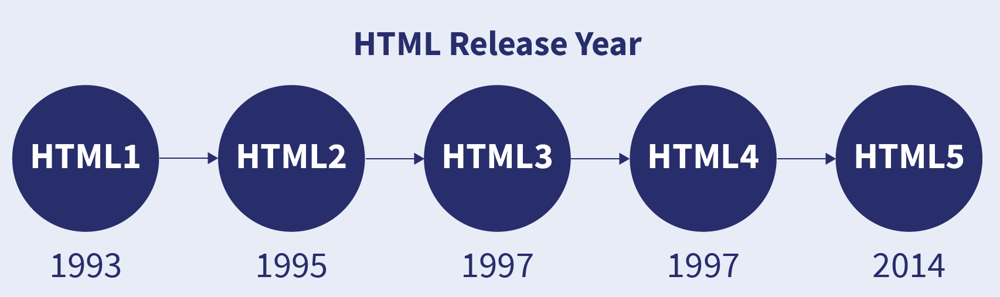

# All important Interview Questions and Answers

## Table of Contents

- [HTML](#html)
- [CSS](#css)
- [JavaScript](#javascript)
- [Angular](#angular)
- [NodeJs](#nodejs)
- [MySQL](#mysql)
- [JavaScript basic programs](#javascript-basic-programs)

<!-- Start HTML -->

## **HTML**

### Q 1. What is HTML?

HTML stands for **_HyperText Markup Language_**. It is a standard text formatting language used for developing web pages released in 1993. HTML is a language that is interpreted by the browser and it tells the browser what to display and how to display.

<div align="center"></div>

### Q 2. What are Tags, Elements and Attributes?

- **Tags:** Tags are the starting and ending parts of an HTML element. They begin with < symbol and end with > symbol. Whatever is written inside < and > are called tags.\
  `<a></a>`
- **Elements:** Elements enclose the contents in between the tags. They consist of structure or expression. It generally consists of a start tag, content, and an end tag.\
  `<a>This is the content</a>`
- **Attributes:** Attribute is used to provide extra or additional information about an element.\
  `<a href="#">This is the content</a>`

### Q 3. What are Semantic Elements?

Semantic HTML elements are those that clearly describe their meaning in a human- and machine-readable way

- `<header>`
- `<nav>`
- `<footer>`
- `<section>`
- `<article>`

### Q 4. What are HTML APIs?

- **Geolocation -** It is used to get the geographical position of a user\
- **Drag and Drop -** In HTML, any element can be dragged and dropped.
- **Web Storage -** With web storage, web applications can store data locally within the user's browser.\
  `LocalStorage` and `SessionStorage`
- **Web Workers -** A web worker is a JavaScript running in the background, without affecting the performance of the page.
- **SSE -** Server-Sent Events (SSE) allow a web page to get updates from a server.

### Q 5. What is the difference between Cookie, Local storage and Session storage?

|                | Cookie       | Local storage | Session storage        |
| -------------- | ------------ | ------------- | ---------------------- |
| **Capacity**   | 4KB          | 10MB          | 5MB                    |
| **Expiration** | Manually set | Never         | On tab/browser close   |
| **Read**       | Client       | Client        | Both Client and Server |

<div align="right"><b><a href="#table-of-contents">↥ Back to top</a></b></div>

<!-- Start CSS -->

## **CSS**

### Q 1. What is CSS?

CSS stands for **_Cascading Style Sheets_**. It is a style sheet language, which is used to describe the look and formatting of a document written in **_HTML_**.

### Q 2. What is the Box model in CSS?

The CSS box model is a container that contains multiple properties like content, padding, border and margin. It is used to create the design and layout of web pages.

<div align="center"></div>

### Q 3. What are Pseudo class and Pseudo element ?

- **Pseudo class** is used to define the special state of an element like when the user is hovering over the link.
  - :hover
  - :active
  - :focus
  - ```css
    a: hover {
      color: #FFOOFF;
    }
    ```
- **Pseudo element** is used to add style to specified parts of an element. Example: Using style before or after an element
  - ::before
  - ::after
  - ::first-letter
  - ```css
    p::first-line {
      color: #ffOOOO;
    }
    ```

### Q 4. What is a z-index?

It is used to define the order of elements if they overlap with each other.\
Syntax

> z-index: auto | number | initial | inherit;

- auto: The stack order is equal to that of the parent(default).
- number: The stack order depends on the number.
- initial: Sets the property to its default value.
- inherit: Inherits the property from the parent element.

<div align="center"></div>

### Q 5. Explain CSS Absolute and Relative position property?

position: relative places an element relative to its current position without changing the layout around it, whereas position: absolute places an element relative to its parent’s position and changing the layout around it

- **Absolute:** Position absolute places an element relative to its parent’s position and changing the layout around it.
- **Relative:** Position relative places an element relative to its current position without changing the layout around it.

<div align="center"></div>

### Q 6. How to center align a div inside another div?

```html
<div class="”outer”">
  <div class="”inner”">your content</div>
</div>
```

```css
/* First method */
.outer {
  display: flex;
  justify-content: center;
  align-items: center;
}

/* Second method */
.outer {
  display: grid;
  place-content: center;
}
```

### Q 7. How can we make our website responsive using CSS?

Media query is used to create a responsive web design. It means that the view of a web page differs from system to system based on screen or media types.

- Width and height of the viewport
- Width and height of the device
- Orientation
- Resolution

Syntax

```css
/* @media not|only mediatype and (mediafeature and|or|not mediafeature) */
@media only screen and (max-width: 600px) {
  /* CSS-Code; */
}
```

### Q 8. How to change the color for even and odd list items.

```css
/* Change the background color odd in list ex. 1,3,5,7  */
tr:nth-child(odd) {
  background-color: lightblue;
}

/* Change the background color even in list ex. 2,4,6,8  */
tr:nth-child(even) {
  background-color: lightgreen;
}

/* Change the background color to specific item in a list  */
tr:nth-child(4) {
  background-color: lightcoral;
}
```

### Q 9. What is CSS flexbox, and what are its properties?

It is also called a flexible box model. It is basically a layout model that provides an easy and clean way to arrange items within a container. Flexbox is different from the block model which is vertically biased and the inline which is horizontally biased. Flexbox was created for small-scale layouts and there’s another standard called grids which are geared more towards larger-scale layouts, It works similar to the way to Twitter bootstrap grid system works. Flexbox is responsive and mobile-friendly. To start with flexbox firstly create a flex container. To create a flex container set the display property to flex.

**Flex Properties:**

- **flex-direction:** row, column, row-reverse, column-reverse
- **flex-wrap:** wrap, nowrap, wrap-reverse
- **flex-flow:** This property is used for setting both flex-direction and flex-wrap properties in one statement
- **justify-content** center, flex-start, flex-end, space-around, space-between
- **align-items** This is used for aligning flex items
- **align-content** This is used for aligning the flex lines

### Q 10. What is CSS Grid?

It is a CSS property that offers a grid-based layout system, with rows and columns, making it easier to design web pages without floats and positioning.

Syntax:

```
  grid:none|grid-template-rows / grid-template-columns|grid-template-areas|
  grid-template-rows / [grid-auto-flow] grid-auto-columns|[grid-auto-flow]
  grid-auto-rows / grid-template-columns|initial|inherit;
```

<div align="right"><b><a href="#table-of-contents">↥ Back to top</a></b></div>

##

<!-- Start JavaScript -->

## **JavaScript**

### Q. Array Methods

| Method           | Description                                                            |
| ---------------- | ---------------------------------------------------------------------- |
| **. pop()**      | Removes the last element of an array, and returns that element         |
| **. shift()**    | Removes the first element of an array, and returns that element        |
| **. push()**     | Add new elements to the end of an array, and returns the new length    |
| **. unshift()**  | Adds new elements to the start of an array, and returns the new length |
| **. join()**     | Returns a new string by concatenating all of the elements in an array  |
| **. sort()**     | Sorting the array elements based on some condition                     |
| **. reverse()**  | Reversing the order of the elements in an array                        |
| **. slice()**    | Pulling a copy of a part of an array into a new array                  |
| **. toString()** | Converting the array elements into strings                             |

### Q. String Methods

> Ex: _Hello_

| Method                 | Description                                                                         |
| ---------------------- | ----------------------------------------------------------------------------------- |
| **. toLowerCase()**    | _hello_ - Converting strings to lower case                                          |
| **. toUpperCase()**    | _HELLO_ - Converting strings to upper case                                          |
| **. length()**         | _5_ - Count the characters                                                          |
| **. charAt(2)**        | _l_ - Returning the character at a particular index of a string                     |
| **. concat(' world')** | _Hello world_ - Joining multiple strings into a single string                       |
| **. indexOf('e)**      | _1_ - Providing the index of the first appearance of a given text inside the string |

<div align="right"><b><a href="#table-of-contents">↥ Back to top</a></b></div>

##

<!-- Start Angular -->

## **Angular**

### Q 1. What is Angular?

### Q What are the building blocks of angular?

### Q What are the Angular lifecycle hooks?

### Q What are data binding and how many types are there?

### Q What is directive and how many types are there?

### Q What is pipe and types of pipes?

### Q Difference between Pupre and Impure pipe?

### Q What are filters?

### Q What is the async pipe?

### Q How do you share data between components?

### Q What is view encapsulation?

### Q What is a route and types of route?

### Q What is an interceptor?

### Q What is an interface?

### Q What is lazy loading?

### Q What is AOT and JIT?

### Q What are Observables and Promises?

### Q What is RXJS and list some operators?

### Q What is the difference between Subject, Behavior subject, and Replay subject?

### Q What is NGRX?

### Q What is a standalone component?

### Q What is Async/await?

### Q What are the decorators?

### Q What are the advantages of Angular?

### Q What are Template and Reactive forms?

### Q What is dependency injection?

### Q What is angular change detection?

### Q What are the differences between ng-template, ng-container, and ng-content?

<div align="right"><b><a href="#table-of-contents">↥ Back to top</a></b></div>

##

<!-- Start NodeJS -->

## **NodeJS**

<div align="right"><b><a href="#table-of-contents">↥ Back to top</a></b></div>

##

<!-- Start MySQL -->

## **MySQL**

<div align="right"><b><a href="#table-of-contents">↥ Back to top</a></b></div>

##

<!-- Start JavaScript basic programs  -->

## **JavaScript basic programs**

<div align="right"><b><a href="#table-of-contents">↥ Back to top</a></b></div>

##

<!-- Formatting -->

<!-- [Back to top](#table-of-contents) -->
<!-- <div ><b><a href="#table-of-contents">↥ Back to top</a></b></div> -->
