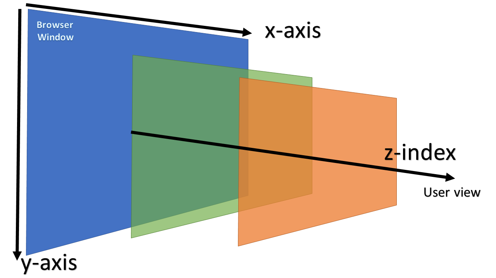

<!-- Start HTML -->

## **HTML**

<div align="right"><b><a href="../../README.md">↥ Back to home</a></b></div>

### Q 1. What is HTML?

HTML stands for **_HyperText Markup Language_**. It is a standard text formatting language used for developing web pages released in 1993. HTML is a language that is interpreted by the browser and it tells the browser what to display and how to display.

<div align="right"><b><a href="#html">↥ Back to top</a></b></div>

### Q 2. What are Tags, Elements and Attributes?

- **Tags:** Tags are the starting and ending parts of an HTML element. They begin with < symbol and end with > symbol. Whatever is written inside < and > are called tags.\
  `<p></p>`
- **Elements:** Elements are made up of tags along with the content they enclose. An element consists of the opening tag, the content, and the closing tag.\
  `<p>Hello, world!</p>`
- **Attributes:** Attributes provide additional information about an element. They are placed within the opening tag of an element and consist of a name-value pair.\
  `<a href="https://www.example.com">Visit Example</a>`

<div align="right"><b><a href="#html">↥ Back to top</a></b></div>

### Q 3. What are Semantic Elements?

Semantic HTML elements are those that clearly describe their meaning in a human- and machine-readable way

- `<header>`
- `<nav>`
- `<footer>`
- `<section>`
- `<article>`

<div align="right"><b><a href="#html">↥ Back to top</a></b></div>

### Q 4. What are HTML APIs?

- **Geolocation -** It is used to get the geographical position of a user\
- **Drag and Drop -** In HTML, any element can be dragged and dropped.
- **Web Storage -** With web storage, web applications can store data locally within the user's browser.\
  `LocalStorage` and `SessionStorage`
- **Web Workers -** A web worker is a JavaScript running in the background, without affecting the performance of the page.
- **SSE -** Server-Sent Events (SSE) allow a web page to get updates from a server.

<div align="right"><b><a href="#html">↥ Back to top</a></b></div>

### Q 5. What is the difference between Cookie, Local storage and Session storage?

|                | Cookie                 | Local storage | Session storage      |
| -------------- | ---------------------- | ------------- | -------------------- |
| **Capacity**   | 4KB                    | 10MB          | 5MB                  |
| **Expiration** | Manually set           | Never         | On tab/browser close |
| **Read**       | Both Client and Server | Client        | Client               |

<div align="right"><b><a href="#html">↥ Back to top</a></b></div>

<!-- Start CSS -->

## **CSS**

### Q 1. What is CSS?

CSS stands for **_Cascading Style Sheets_**. It is a style sheet language, which is used to describe the look and formatting of a document written in **_HTML_**.

<div align="right"><b><a href="#html">↥ Back to top</a></b></div>

### Q 2. What is the Box model in CSS?

The CSS box model is a container that contains multiple properties like content, padding, border and margin. It is used to create the design and layout of web pages.


<div align="right"><b><a href="#html">↥ Back to top</a></b></div>

### Q 3. What are Pseudo class and Pseudo element?

- **Pseudo class** is used to define the special state of an element like when the user is hovering over the link.
  - :hover
  - :active
  - :focus
  - ```css
    a: hover {
      color: #FFOOFF;
    }
    ```
- **Pseudo element** is used to add style to specified parts of an element. Example: Using style before or after an element
  - ::before
  - ::after
  - ::first-letter
  - ```css
    p::first-line {
      color: #ffOOOO;
    }
    ```

<div align="right"><b><a href="#html">↥ Back to top</a></b></div>

### Q 4. What is a z-index?

It is used to define the order of elements if they overlap with each other.\
Syntax

> _**z-index:** auto | number | initial | inherit;_

- auto: The stack order is equal to that of the parent(default).
- number: The stack order depends on the number.
- initial: Sets the property to its default value.
- inherit: Inherits the property from the parent element.



<div align="right"><b><a href="#html">↥ Back to top</a></b></div>

### Q 5. Explain CSS Absolute and Relative position property?

position: relative places an element relative to its current position without changing the layout around it, whereas position: absolute places an element relative to its parent’s position and changing the layout around it

- **Absolute:** Position absolute places an element relative to its parent’s position and changing the layout around it.
- **Relative:** Position relative places an element relative to its current position without changing the layout around it.


<div align="right"><b><a href="#html">↥ Back to top</a></b></div>

### Q 6. How to center align a div inside another div?

```html
<div class="”outer”">
  <div class="”inner”">your content</div>
</div>
```

```css
/* First method */
.outer {
  display: flex;
  justify-content: center;
  align-items: center;
}

/* Second method */
.outer {
  display: grid;
  place-content: center;
}
```

<div align="right"><b><a href="#html">↥ Back to top</a></b></div>

### Q 7. How can we make our website responsive using CSS?

Media query is used to create a responsive web design. It means that the view of a web page differs from system to system based on screen or media types.

- Width and height of the viewport
- Width and height of the device
- Orientation
- Resolution

Syntax

```css
/* @media not|only mediatype and (mediafeature and|or|not mediafeature) */
@media only screen and (max-width: 600px) {
  /* CSS-Code; */
}
```

<div align="right"><b><a href="#html">↥ Back to top</a></b></div>

### Q 8. How to change the color for even and odd list items?

```css
/* Change the background color odd in list ex. 1,3,5,7  */
tr:nth-child(odd) {
  background-color: lightblue;
}

/* Change the background color even in list ex. 2,4,6,8  */
tr:nth-child(even) {
  background-color: lightgreen;
}

/* Change the background color to specific item in a list  */
tr:nth-child(4) {
  background-color: lightcoral;
}
```

<div align="right"><b><a href="#html">↥ Back to top</a></b></div>

### Q 9. What is CSS flexbox, and what are its properties?

It is also called a flexible box model. It is basically a layout model that provides an easy and clean way to arrange items within a container. Flexbox is different from the block model which is vertically biased and the inline which is horizontally biased. Flexbox was created for small-scale layouts and there’s another standard called grids which are geared more towards larger-scale layouts, It works similar to the way to Twitter bootstrap grid system works. Flexbox is responsive and mobile-friendly. To start with flexbox firstly create a flex container. To create a flex container set the display property to flex.

**Flex Properties:**

- **flex-direction:** row, column, row-reverse, column-reverse
- **flex-wrap:** wrap, nowrap, wrap-reverse
- **flex-flow:** This property is used for setting both flex-direction and flex-wrap properties in one statement
- **justify-content** center, flex-start, flex-end, space-around, space-between
- **align-items** This is used for aligning flex items
- **align-content** This is used for aligning the flex lines

<div align="right"><b><a href="#html">↥ Back to top</a></b></div>

### Q 10. What is CSS Grid?

It is a CSS property that offers a grid-based layout system, with rows and columns, making it easier to design web pages without floats and positioning.

Syntax:

> grid:none|grid-template-rows / grid-template-columns|grid-template-areas|\
> grid-template-rows / [grid-auto-flow] grid-auto-columns|[grid-auto-flow]
> grid-auto-rows / grid-template-columns|initial|inherit;

<div align="right"><b><a href="#html">↥ Back to top</a></b></div>

##
