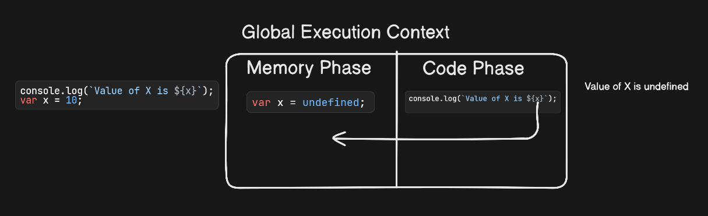
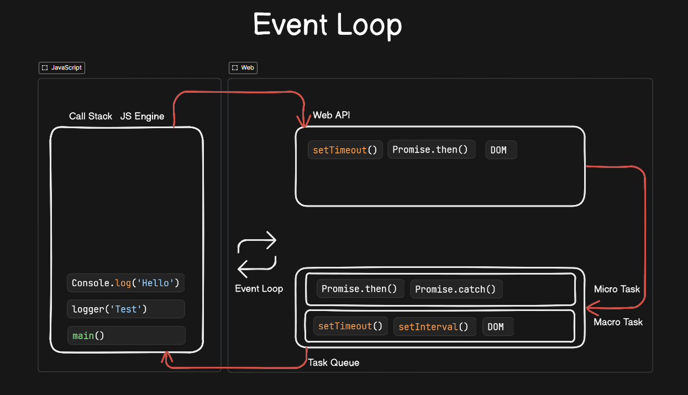

<!-- Start JavaScript -->

# **JavaScript**

<div align="right"><b><a href="../../README.md">↥ Back to home</a></b></div>

### Q 1. What is Javascript?

JavaScript is a dynamically typed, single-threaded language used for building web and server side applications. It runs in browsers and on the server using environments like Node.js. JavaScript supports event-driven, non-blocking, and asynchronous programming.

> _**JavaScript, created by Brendan Eich in 1995.**_

<div align="right"><b><a href="#javascript">↥ Back to top</a></b></div>

### Q 2. What are the data types in JavaScript?

In JavaScript, data types are divided into primitive and non-primitive data type.

**1. Primitive:**

1. **Number:** Represents integers & floating-point numbers.
2. **String:** Represents text values.
3. **Boolean:** Represents a logical value, either true or false.
4. **Undefined:** Represents a variable that has been declared but not assigned a value.
5. **Null:** Represents the intentional empty value.
6. **Symbol (ES6):** Represents a unique and immutable value and used for object keys.
7. **BigInt:** Represents large integers beyond Number limit.

**2. Non Primitive:**

1. **Object:** Represents a collection of key-value pairs where keys are strings (or symbols) and values can be of any data type, including other objects.
2. **Array:** Represents a collection of elements, usually of the same data type, indexed by non-negative integers.

> _**👉 Note:** Primitive types are copied by value, while objects are copied by reference._

<div align="right"><b><a href="#javascript">↥ Back to top</a></b></div>

### Q 3. What are difference between var, let and const?

| Feature        | `var`                               | `let`                                | `const`                              |
| -------------- | ----------------------------------- | ------------------------------------ | ------------------------------------ |
| Scope          | Function-scoped                     | Block-scoped                         | Block-scoped                         |
| Re-declaration | ✅ Allowed                          | ❌ Not allowed                       | ❌ Not allowed                       |
| Reassignment   | ✅ Allowed                          | ✅ Allowed                           | ❌ Not allowed                       |
| Hoisting       | ✅ Yes (initialized as `undefined`) | ✅ Yes (TDZ, not usable before init) | ✅ Yes (TDZ, not usable before init) |

> _**👉 Note:** let and const are hoisted, but due to the Temporal Dead Zone (TDZ) and cannot be accessed before declaration._

### Q 4. What is hoisting?

Hoisting is JavaScript’s behavior of moving variable and function declarations to the top of their scope during compilation. Function declarations are fully hoisted, while variables declared with var are hoisted with an initial value of undefined. let and const are hoisting but due to the temporal dead zone, throws a ReferenceError.

> _**👉 NOTE:** Only declarations are hoisted, not initializations_

```js
console.log(a); // undefined
var a = 10;

console.log(b); // ❌ ReferenceError (TDZ)
let b = 20;

sayHi(); // ✅ works
function sayHi() {
  console.log("Hi");
}
```

### Q 5. What is closure?

A closure is a function that remembers the variables from its outer scope, even after the outer function has finished executing. This allows the inner function to access and manipulate those variables whenever it’s called.

**Common Use Cases**

- Data privacy (like private variables)
- Function factories
- Maintaining state (e.g., counters, caching)

```javascript
function outer() {
  let count = 0;

  return function inner() {
    count++;
    return count;
  };
}

const counter = outer();

console.log(counter()); // 1
console.log(counter()); // 2
console.log(counter()); // 3
```

<div align="right"><b><a href="#javascript">↥ Back to top</a></b></div>

### Q 6. What is passed by value and passed by reference?

In JavaScript, primitives are passed by value, while objects are pass-by-reference.
Pass by value means a copy of the value is passed, so changes don’t affect the original. Pass by reference means a reference is passed, so changes affect the original object.

```javascript
// Passed by Value:
function update(x) {
  return (x = 10);
}

let num = 5;
console.log(update(num)); // Output: 10
console.log(num); // Output: 5 (original variable remains unchanged)

// Passed by Reference:
function addName(person) {
  person.name = "John";
  return person;
}

let user = { name: "Alice" };
console.log(addName(user)); // Output: { name: 'John' }
console.log(user); // Output: { name: 'John' } (original object is modified)
```

<div align="right"><b><a href="#javascript">↥ Back to top</a></b></div>

### Q 7. Explain call(), apply() and, bind() methods?

`call()`, `apply()`, and `bind()` are methods in JavaScript, which is used to invoke a function.

1. **call():** This method invokes a function with a given `this` value and takes arguments as comma separated.

```javascript
var employee1 = { firstName: "John", lastName: "Rodson" };
var employee2 = { firstName: "Jimmy", lastName: "Baily" };

function invite(greeting1, greeting2) {
  console.log(
    greeting1 + " " + this.firstName + " " + this.lastName + ", " + greeting2,
  );
}

invite.call(employee1, "Hello", "How are you?"); // Hello John Rodson, How are you?
invite.call(employee2, "Hello", "How are you?"); // Hello Jimmy Baily, How are you?
```

2. **apply():** This method invokes a function with a given `this` value and takes arguments as an array.

```javascript
var employee1 = { firstName: "John", lastName: "Rodson" };
var employee2 = { firstName: "Jimmy", lastName: "Baily" };

function invite(greeting1, greeting2) {
  console.log(
    greeting1 + " " + this.firstName + " " + this.lastName + ", " + greeting2,
  );
}

invite.apply(employee1, ["Hello", "How are you?"]); // Hello John Rodson, How are you?
invite.apply(employee2, ["Hello", "How are you?"]); // Hello Jimmy Baily, How are you?
```

3. **bind():** Returns a new function and takes arguments as comma separated.

```javascript
var employee1 = { firstName: "John", lastName: "Rodson" };
var employee2 = { firstName: "Jimmy", lastName: "Baily" };

function invite(greeting1, greeting2) {
  console.log(
    greeting1 + " " + this.firstName + " " + this.lastName + ", " + greeting2,
  );
}

var inviteEmployee1 = invite.bind(employee1);
var inviteEmployee2 = invite.bind(employee2);
inviteEmployee1("Hello", "How are you?"); // Hello John Rodson, How are you?
inviteEmployee2("Hello", "How are you?"); // Hello Jimmy Baily, How are you?
```

<div align="right"><b><a href="#javascript">↥ Back to top</a></b></div>

### Q 8. What is currying?

Currying is a technique where a function with multiple arguments is transformed into a sequence of functions, each taking one argument at a time.
Currying is mainly used to break down a function into reusable pieces and allow partial application.

```javascript
// Normal function
const add = (a, b, c) => {
  return a + b + c;
};
console.log(add(10, 10, 10)); // 30

// Currying function
const addCurry = (a) => {
  return (b) => {
    return (c) => {
      return a + b + c;
    };
  };
};
console.log(addCurry(20)(20)(20)); // 60
```

<div align="right"><b><a href="#javascript">↥ Back to top</a></b></div>

### Q 9. What is the rest parameter and spread operator?

The rest parameter collects multiple arguments into an array inside a function, while the spread operator expands arrays or objects into individual elements. Both use the `...` syntax but serve opposite purposes.

The rest parameter collects multiple arguments into an array in function. The spread operator expands arrays or objects into individual elements. Both use the `...` syntax.

> _**👉 NOTE:** Rest parameter should always be used at the last parameter of a function._

1. **Rest Parameter (`...`):** Rest parameter is an improved way to handle function parameters which allows us to represent an indefinite number of arguments as an array.\
    _**Example:**_
   ```javascript
   function sum(...numbers) {
     return numbers.reduce((total, num) => total + num, 0);
   }
   console.log(sum(1, 2, 3, 4, 5)); // Output: 15
   ```
2. **Spread Operator (...):** Spread operator allows iterables( arrays / objects / strings ) to be expanded into single arguments/elements.\
   _**Example:**_

   ```javascript
   function sum(x, y, z) {
     return x + y + z;
   }
   const numbers = [10, 20, 30];

   // Using Apply (ES5)
   console.log(sum.apply(null, numbers)); // 60

   // Using Spread Operator
   console.log(sum(...numbers)); // 60
   ```

   1. **Copying an array:**

      ```javascript
      let fruits = ["Apple", "Orange", "Banana"];
      let newFruitArray = [...fruits];

      console.log(newFruitArray); // Output: ['Apple', 'Orange', 'Banana']
      ```

   2. **Concatenating arrays:**

      ```javascript
      let arr1 = ["A", "B", "C"];
      let arr2 = ["X", "Y", "Z"];

      let result = [...arr1, ...arr2];

      console.log(result); // Output: ['A', 'B', 'C', 'X', 'Y', 'Z']
      ```

   3. **Spread syntax for object literals**

      ```javascript
      const obj1 = { id: 101, name: 'Rajiv Sandal' }
      const obj2 = { age: 35, country: 'INDIA' }

      const employee = { ...obj1, ...obj2 }

      console.log(employee);

      // Output
      {
        "id": 101,
        "name": "Rajiv Sandal",
        "age": 35,
        "country": "INDIA"
      }
      ```

<div align="right"><b><a href="#javascript">↥ Back to top</a></b></div>

### Q 10. What are Sets and WeakSet?

1.  **Sets:** Sets are a new object type in ES6, that allow to create collections of unique values and it automatically removes duplicates. It can hold any data type, including primitives and objects.

    ```javascript
    let numbers = new Set([10, 20, 20, 30, 40, 50]);

    console.log(numbers); // Set(5) { 10, 20, 30, 40, 50 }
    console.log(typeof numbers); // Object

    const set = new Set();

    set.add(1);
    set.add(2);
    set.add(2); // duplicate ignored
    set.add("hello");

    console.log(set); // {1, 2, "hello"}
    console.log(set.has(2)); // true

    for (let value of set) {
      console.log(value); // iterable
    }
    ```

2.  **WeakSet:** WeakSet is a collection of unique objects and only allows object values. It is not iterable and does not maintain order. Objects are weakly referenced, so they can be garbage collected automatically.

    ```javascript
    const newSet = new Set([4, 5, 6, 7]);
    console.log(newSet); // Outputs Set {4,5,6,7}

    const newSet2 = new WeakSet([3, 4, 5]); //Throws an error

    let obj1 = { message: "Hello world" };
    const newSet3 = new WeakSet([obj1]);
    console.log(newSet3.has(obj1)); // true
    ```

**🔥 Key Differences**

- Set → any values, iterable, strong reference
- WeakSet → only objects, not iterable, weak reference (GC-friendly)

<div align="right"><b><a href="#javascript">↥ Back to top</a></b></div>

### Q 11. What are Map and WeakMap?

1. **Map:** Map is a collection of key-value pairs where keys can be of any data type, including primitives and objects. It supports iteration

   ```javascript
   const map = new Map();

   map.set("name", "Nashir");
   map.set(1, "number key");

   console.log(map.get("name")); // Nashir
   console.log(map.has(1)); // true

   for (let [key, value] of map) {
     console.log(key, value); // key: name, value: Nashir; key: 1, value: number key
   }
   ```

2. **WeakMap:** WeakMap is similar to Map but only allows objects as keys and it is not iterable and has no size property. Keys are weakly referenced, so they can be garbage collected.

   ```javascript
   // WeakMap()
   let obj = {};
   const weakMap = new WeakMap();

   weakMap.set(obj, "data");
   console.log(weakMap.get(obj));
   ```

**🔥 Key Differences**

- Map → any key type, iterable, strong reference
- WeakMap → only object keys, not iterable, weak reference

<div align="right"><b><a href="#javascript">↥ Back to top</a></b></div>

### Q 12. What is destructuring?

Destructuring is a convenient way to extract multiple values from arrays or objects into variables. It makes code cleaner and more readable.

```javascript
// Arrays
const arr = [1, 2, 3];
const [a, b] = arr;

console.log(a, b); // 1 2

// Objects
const user = { name: "Nashir", age: 30 };
const { name, age } = user;

console.log(name); // Nashir
console.log(age); // 30
```

<div align="right"><b><a href="#javascript">↥ Back to top</a></b></div>

### Q 13. What are generators?

A generator is a function that can stop midway and then continue from where it stopped. In short, a generator appears to be a function but it behaves like an `iterator`.

_**Example:**_

```javascript
function* generator(num) {
  yield num + 10;
  yield num + 20;
  yield num + 30;
}
let gen = generator(10);

console.log(gen.next().value); // 20
console.log(gen.next().value); // 30
console.log(gen.next().value); // 40
```

<div align="right"><b><a href="#javascript">↥ Back to top</a></b></div>

### Q 14. What is the difference between null and undefined?

| Null                                                                                | Undefined                                                                                      |
| ----------------------------------------------------------------------------------- | ---------------------------------------------------------------------------------------------- |
| Type of null is object                                                              | Type of undefined is undefined                                                                 |
| Undefined means a variable has been declared but has yet not been assigned a value. | Null is an assignment value. It can be assigned to a variable as a representation of no value. |

<div align="right"><b><a href="#javascript">↥ Back to top</a></b></div>

### Q 15. What is the difference between window and document?

| Window                                                                        | Document                                                                                      |
| ----------------------------------------------------------------------------- | --------------------------------------------------------------------------------------------- |
| It is the root level element in any web page                                  | It is the direct child of the window object. This is also known as Document Object Model(DOM) |
| It has methods like alert(), confirm() and properties like document, location | It provides methods like getElementById, getElementsByTagName, createElement etc              |

<div align="right"><b><a href="#javascript">↥ Back to top</a></b></div>

### Q 16. What is the difference between == and === operators?

In JavaScript, the `==` and `===` operators are used for comparison and `===` checks both the values and the types, and only returns true if both are the same.

_**Example:**_

```javascript
0 == false // true
0 === false // false
1 == "1" // true
1 === "1" // false
null == undefined // true
null === undefined // false
"0" == false // true
"0" === false // false
[] === [] // false, refer different objects in memory
{} === {} // false, refer different objects in memory
```

<div align="right"><b><a href="#javascript">↥ Back to top</a></b></div>

### Q 17. What are typeOf, delete, void, and ternary operators?

1. **`typeof` Operator:** This is used to determine the type of a value or expression
   _**Example:**_

   ```javascript
   typeof 42; // Returns "number"
   typeof "hello"; // Returns "string"
   typeof true; // Returns "boolean"
   ```

2. **`delete` Operator:** This operator is used to delete a property from an object.
   _**Example:**_

   ```javascript
   const obj = { a: 1, b: 2 };
   delete obj.a; // Deletes the property "a" from the object
   ```

3. **`void` Operator:** This operator evaluates an expression and returns undefined. It's often used to create a URL with a JavaScript "void" link, where clicking the link does nothing.
   _**Example:**_

   ```html
   <a href="javascript:void(0)">Click me</a>
   ```

4. **Ternary (`? :`) Operator:** The ternary operator is a conditional operator that evaluates a condition and returns one of two expressions based on whether the condition is true or false.
   _**Example:**_

   ```javascript
   const age = 20;
   const status = age >= 18 ? "adult" : "minor";
   console.log(status); // Output depends on the value of age
   ```

<div align="right"><b><a href="#javascript">↥ Back to top</a></b></div>

### Q 18. What is isNaN?

`isNaN()` is a global JavaScript function used to check whether a value is **Not-a-Number**. It returns true for invalid numeric values like "abc" and false for valid numbers like "123".

> _**👉 NOTE:** In modern JavaScript, Number.isNaN() is preferred because it avoids type coercion.._

_**Example:**_

```javascript
isNaN("Hello"); // true
isNaN("100"); // false
typeof NaN; // Number
Number.isNaN("Hello"); // false
```

<div align="right"><b><a href="#javascript">↥ Back to top</a></b></div>

### Q 19. What are arrow/lambda functions?

An arrow function is a shorter syntax for writing function expressions. It does not have its own `this`, `arguments`, or `super`; instead, it inherits `this` from the surrounding scope. It also cannot be used as a constructor.

_**Example:**_

```javascript
const arrowFunc1 = (a, b) => a + b; // Multiple parameters
const arrowFunc2 = (a) => a * 10; // Single parameter
const arrowFunc3 = () => {}; // no parameters
```

<div align="right"><b><a href="#javascript">↥ Back to top</a></b></div>

### Q 20. What is a first class function?

In javaScript, functions can be stored as a variable or it can be passed as an argument or be returned by another function. That makes function first-class function in JavaScript.

_**Example:**_

```javascript
// 01: Assign a function to a variable
const message = function () {
  console.log("Hello World!");
};
message(); // Invoke it using the variable

// 02: Pass a function as an Argument
function sayHello() {
  return "Hello, ";
}

function greeting(helloMessage, name) {
  console.log(helloMessage() + name);
}

// Pass `sayHello` as an argument to `greeting` function
greeting(sayHello, "JavaScript!");

// 03: Return a function
function sayHello() {
  return function () {
    console.log("Hello!");
  };
}
```

<div align="right"><b><a href="#javascript">↥ Back to top</a></b></div>

### Q 21. What is a higher order function?

A Higher-Order function is a function that receives a function as an argument or returns the function as output.

_**Example:**_, `.map()`, `.filter()`, `.forEach()` and `.reduce()` are some of the Higher-Order functions in javascript.

<div align="right"><b><a href="#javascript">↥ Back to top</a></b></div>

### Q 22. What are the types of errors in javascript?

Here are some common types of errors in JavaScript:

1. **Syntax Errors:** Occur when code breaks JavaScript grammar rules, detected before execution.

```javascript
console.log("Hello" // Missing closing parenthesis
```

2. **Reference Errors:** Reference errors occur when code tries to access a variable or function that does not exist or is not in scope. These errors are thrown at runtime when the JavaScript engine cannot find the referenced variable or function.

```javascript
console.log(y); // ReferenceError: y is not defined
```

3. **Type Errors:** These errors are thrown at runtime when the JavaScript engine encounters an unexpected data type or an incompatible operation.

```javascript
let x = "10";
console.log(x.toUpperCase()); // TypeError: x.toUpperCase is not a function
```

<div align="right"><b><a href="#javascript">↥ Back to top</a></b></div>

### Q 23. What is recursion in a programming language?

Recursion is a method of performing an operation iterate by having a function call itself repeatedly until it reaches a result.

Recursion is a programming technique where a function calls itself repeatedly until it reaches a result.

_**Example:**_

```javascript
// Ex: 1
function sumArray(arr) {
  if (arr.length === 0) return 0;
  return arr[0] + sumArray(arr.slice(1));
}
console.log(sumArray([1, 2, 3, 4, 5])); // Output: 15 (1 + 2 + 3 + 4 + 5)

// Ex: 2
function sum(n) {
  if (n === 0) return 0; // base case
  return n + sum(n - 1);
}
console.log(sum(5)); // 15
```

<div align="right"><b><a href="#javascript">↥ Back to top</a></b></div>

### Q 24. What are callbacks?

A callback is a function that is passed as an argument to another function and that will be executed after another function gets executed.

_**Example:**_

```javascript
function divideByHalf(sum) {
  console.log(Math.floor(sum / 2));
}

function multiplyBy2(sum) {
  console.log(sum * 2);
}

function operationOnSum(num1, num2, operation) {
  var sum = num1 + num2;
  operation(sum);
}

operationOnSum(3, 3, divideByHalf); // Outputs 3
operationOnSum(5, 5, multiplyBy2); // Outputs 20
```

<div align="right"><b><a href="#javascript">↥ Back to top</a></b></div>

### Q 25. What is a callback hell?

Callback Hell happens when you have multiple nested callbacks which makes code hard to read and debug when dealing with asynchronous logic. The callback hell usually looks like a pyramid of doom.

_**Example:**_

```javascript
// Example 1:
async1(function(){
    async2(function(){
        async3(function(){
            async4(function(){
                ....
            });
        });
    });
});

// Example 2:
doSomething(function(err, result1) {
    if (err) throw err;
    doSomethingElse(result1, function(err, result2) {
        if (err) throw err;
        doAnotherThing(result2, function(err, result3) {
            if (err) throw err;
            finalTask(result3, function(err, result4) {
                if (err) throw err;
                console.log('All tasks completed:', result4);
            });
        });
    });
});
```

**Ways to Avoid Callback Hell:**

- **Using Promises**.

  ```js
  doSomething()
    .then((result1) => doSomethingElse(result1))
    .then((result2) => doAnotherThing(result2))
    .then((result3) => finalTask(result3))
    .then((result4) => {
      console.log("All tasks completed:", result4);
    })
    .catch((err) => {
      console.error("Error:", err);
    });
  ```

- **Using async/await**

  ```js
  async function main() {
    try {
      const result1 = await doSomething();
      const result2 = await doSomethingElse(result1);
      const result3 = await doAnotherThing(result2);
      const result4 = await finalTask(result3);

      console.log("All tasks completed:", result4);
    } catch (err) {
      console.error("Error:", err);
    }
  }

  main();
  ```

<div align="right"><b><a href="#javascript">↥ Back to top</a></b></div>

### Q 26. What is a promise?

Promise is used to handle asynchronous operations. It helps avoid callback hell and makes the code cleaner and easier to manage using `.then()`, `.catch()`, and `async/await`.

_There are 3 states in promises:_

1.  **Pending:** Operation is still running.
2.  **Fulfilled/Resolved:** Operation completed successfully.
3.  **Rejected:** Operation failed.

_**Example:**_

```javascript
const promise = new Promise((resolve, reject) => {
  let success = true;

  if (success) {
    resolve("Data fetched successfully");
  } else {
    reject("Something went wrong");
  }
});

promise
  .then((result) => console.log(result))
  .catch((error) => console.log(error));
```

_These are the methods in promises:_

| Method           | Purpose                 |
| ---------------- | ----------------------- |
| `.then()`        | Handles success         |
| `.catch()`       | Handles error           |
| `.finally()`     | Runs always             |
| `Promise.all()`  | Wait for all Promises   |
| `Promise.race()` | Returns fastest Promise |

1. **then(onFulfilled, onRejected):** This method is used to handle the resolved value (fulfillment) or the reason for rejection of the promise.
   ```javascript
   promise.then(
     (value) => console.log("Fulfilled:", value),
     (reason) => console.error("Rejected:", reason),
   );
   ```
2. **catch(onRejected):** This method is used to handle the rejection reason of the promise.
   ```javascript
   promise.catch((reason) => console.error("Rejected:", reason));
   ```
3. **finally(onFinally):** This method is used to execute a callback function regardless of whether the promise is fulfilled or rejected. It is commonly used for cleanup operations such as closing resources.
   ```javascript
   promise.finally(() => console.log("Finally executed"));
   ```
4. **Promise.all(iterable):** This method returns a single promise that resolves when all of the promises in the iterable argument have resolved, or rejects with the reason of the first promise that rejects. It is commonly used to wait for multiple asynchronous tasks to complete simultaneously.
   ```javascript
   Promise.all([promise1, promise2, promise3])
     .then((values) => console.log("All resolved:", values))
     .catch((reason) =>
       console.error("One or more promises rejected:", reason),
     );
   ```
5. **Promise.race(iterable):** This method returns a promise that resolves or rejects as soon as one of the promises in the iterable resolves or rejects, with the value or reason from that promise. It is commonly used to race multiple asynchronous tasks and take the result of the fastest one.
   ```javascript
   Promise.race([promise1, promise2, promise3])
     .then((value) => console.log("First resolved:", value))
     .catch((reason) => console.error("First rejected:", reason));
   ```

<div align="right"><b><a href="#javascript">↥ Back to top</a></b></div>

### Q 27. What is promise.all()?

Promise.all is a promise that takes an array of promises as an input (an iterable), and it gets resolved when all the promises get resolved or any one of them gets rejected.

_**Example:**_

```javascript
// promise.all()
const promise1 = new Promise((resolve, reject) => {
  setTimeout(resolve, 10, "First");
});

const promise2 = new Promise((resolve, reject) => {
  setTimeout(resolve, 20, "Second");
});

Promise.all([promise1, promise2])
  .then((values) => {
    console.log(values);
  })
  .catch((error) => console.log(`Error in promises ${error}`));
// expected output: Array ["First", "Second"]
```

<div align="right"><b><a href="#javascript">↥ Back to top</a></b></div>

### Q 28. Explain arrays?

JavaScript array is an object that represents a collection of similar type of elements. It can holds values (of any type) not particularly in named properties/keys, but rather in numerically indexed positions.

_**Example:**_

1. _Creating an array_

   ```javascript
   // array of numbers
   const numbers = [10, 20, 30, 40, 50];

   // using new keyword
   const numbers = new Array(10, 20, 30, 40, 50);

   // array of strings
   let fruits = ["Apple", "Orange", "Plum", "Mango"];
   ```

2. _Accessing array elements_

   ```javascript
   let fruits = ["Apple", "Orange", "Plum", "Mango"];

   fruits[0]; // Apple
   fruits[fruits.length - 1]; // Mango

   // Iterate array elements
   for (let i = 0; i < fruits.length; i++) {
     console.log(fruits[i]);
   }
   ```

3. _Adding new array elements_

   ```javascript
   let fruits = ["Apple", "Orange", "Plum", "Mango"];

   fruits.push("Grapes"); // Adds a new element (Grapes) to fruits
   ```

<div align="right"><b><a href="#javascript">↥ Back to top</a></b></div>

### Q 29. Write some array methods?

1. **array.join():** The join() method creates and returns a new string by concatenating all of the elements in an array.

```javascript
var elements = ["Fire", "Air", "Water"];

console.log(elements.join()); // Output: "Fire,Air,Water"
console.log(elements.join("")); // Output: "FireAirWater"
console.log(elements.join("-")); // Output: "Fire-Air-Water"
```

2. **array.pop():** The pop() method removes the last element from an array and returns that element.

```javascript
var plants = ["broccoli", "cauliflower", "kale"];

console.log(plants.pop()); // Output: "kale"
console.log(plants); // Output: Array ["broccoli", "cauliflower"]
console.log(plants.pop()); // Output: "cauliflower"
```

3. **array.push():** The push() method adds one or more elements to the end of an array.

```javascript
const animals = ["pigs", "goats", "sheep"];

const count = animals.push("cows");
console.log(animals); // Output: Array ["pigs", "goats", "sheep", "cows"]
```

4. **array.shift():** The shift() method removes the first element from an array and returns that removed element.

```javascript
var fruits = ["Banana", "Orange", "Apple", "Mango"];
fruits.shift();
console.log(fruits); // Output: Array ["Orange", "Apple", "Mango"]
```

5. **array.unshift():** The unshift() method adds one or more elements to the beginning of an array.

```javascript
var fruits = ["Banana", "Orange", "Apple"];
fruits.unshift("Mango", "Pineapple");
console.log(fruits); // Output: Array ["Mango", "Pineapple", "Banana", "Orange", "Apple"]
```

6. **array.concat():** The concat() method is used to merge two or more arrays. This method does not change the existing arrays, but instead returns a new array.

```javascript
const array1 = ["a", "b", "c"];
const array2 = ["d", "e", "f"];

console.log(array1.concat(array2)); // Output: Array ["a", "b", "c", "d", "e", "f"]
```

7. **array.map():** The map() method creates a new array with the results of calling a provided function on every element in the calling array.

```javascript
var array1 = [1, 4, 9, 16];

// pass a function to map
const map1 = array1.map((x) => x * 2);

console.log(map1); // Output: Array [2, 8, 18, 32]
```

8. **array.filter():** The filter() method creates a new array with all elements that pass the test implemented by the provided function.

```javascript
var words = ["spray", "limit", "elite", "exuberant", "destruction"];

const result = words.filter((word) => word.length > 6);

console.log(result); // Output: Array ["exuberant", "destruction"]
```

9. **array.reduce():** The reduce() method executes a reducer function (that you provide) on each element of the array, resulting in a single output value.

```javascript
const array1 = [1, 2, 3, 4];
const reducer = (accumulator, currentValue) => accumulator + currentValue;

console.log(array1.reduce(reducer)); // Output: 10
console.log(array1.reduce(reducer, 5)); // Output: 15
```

10. **array.every():** The every() method tests whether all elements in the array pass the test implemented by the provided function. It returns a Boolean value.

```javascript
function isBelowThreshold(currentValue) {
  return currentValue < 40;
}

var array1 = [1, 30, 39, 29, 10, 13];
console.log(array1.every(isBelowThreshold)); // Output: true
```

11. **array.some():** The some() method tests whether at least one element in the array passes the test implemented by the provided function. It returns a Boolean value.

```javascript
var array = [1, 2, 3, 4, 5];

var even = function (element) {
  // checks whether an element is even
  return element % 2 === 0;
};

console.log(array.some(even)); // Output: true
```

12. **array.find():** The find() method returns the value of the first element in the provided array that satisfies the provided testing function.

```javascript
var array1 = [5, 12, 8, 130, 44];

var found = array1.find(function (element) {
  return element > 100;
});

console.log(found); // Output: 130
```

13. **array.includes():** The includes() method determines whether an array includes a certain value among its entries, returning true or false as appropriate.

```javascript
var array1 = [1, 2, 3];
console.log(array1.includes(2)); // Output: true

var pets = ["cat", "dog", "bat"];
console.log(pets.includes("at")); // Output: false
```

<div align="right"><b><a href="#javascript">↥ Back to top</a></b></div>

### Q 30. Write some string methods?

1. **string.charAt():** Returns the character at the specified index in the string.

```javascript
const str = "Hello";
console.log(str.charAt(0)); // Output: "H"
```

2. **string.concat():** Combines two or more strings and returns a new string.

```javascript
const str1 = "Hello";
const str2 = "World";
console.log(str1.concat(" ", str2)); // Output: "Hello World"
```

3. **string.includes():** Checks if the string contains the specified substring.

```javascript
const str = "Hello World";
console.log(str.includes("World")); // Output: true
```

4. **string.indexOf():** Returns the index of the first occurrence of a specified value in a string, or -1 if not found.

```javascript
const str = "Hello World";
console.log(str.indexOf("o")); // Output: 4
```

5. **string.replace():** Replaces a specified value with another value in a string.

```javascript
const str = "Hello World";
console.log(str.replace("World", "Universe")); // Output: "Hello Universe"
```

6. **string.slice():** Extracts a section of a string and returns a new string.

```javascript
const str = "Hello World";
console.log(str.slice(6)); // Output: "World"
```

7. **string.split():** Splits a string into an array of substrings based on a specified separator.

```javascript
const str = "Hello World";
console.log(str.split(" ")); // Output: ["Hello", "World"]
```

8. **string.toLowerCase():** Converts the string to lowercase or uppercase, respectively.

```javascript
const str = "Hello World";
console.log(str.toLowerCase()); // Output: "hello world"
console.log(str.toUpperCase()); // Output: "HELLO WORLD"
```

9. **string.trim():** Removes whitespace from both ends of a string.

```javascript
const str = "   Hello World   ";
console.log(str.trim()); // Output: "Hello World"
```

<div align="right"><b><a href="#javascript">↥ Back to top</a></b></div>

### Q 31. What is the difference between slice and splice?

| Slice                                | Splice                                       |
| ------------------------------------ | -------------------------------------------- |
| Doesn't modify the original array    | Modifies the original array                  |
| Returns the subset of original array | Returns the deleted elements as array        |
| Used to pick the elements from array | Used to insert/delete elements to/from array |

<div align="right"><b><a href="#javascript">↥ Back to top</a></b></div>

### Q 32. What is loop?

A loop in JavaScript is a programming construct that allows you to repeatedly execute a block of code multiple times until a specified condition is met. Loops are fundamental for iterating over arrays, processing data, and performing repetitive tasks efficiently. JavaScript provides several types of loops to suit different use cases:

1. **`for` Loop:** The for loop is used to execute a block of code a specified number of times.

```javascript
for (let i = 0; i < 5; i++) {
  console.log(i); // Output: 0, 1, 2, 3, 4
}
```

2. **`while` Loop:** The while loop is used to execute a block of code as long as a specified condition is true.

```javascript
let i = 0;
while (i < 5) {
  console.log(i); // Output: 0, 1, 2, 3, 4
  i++;
}
```

3. **`do...while` Loop:** The do...while loop is similar to the while loop, but it always executes the block of code at least once, even if the condition is false.

```javascript
let i = 0;
do {
  console.log(i); // Output: 0, 1, 2, 3, 4
  i++;
} while (i < 5);
```

4. **`for...in` Loop:** The for...in loop iterates over the enumerable properties of an object, including inherited properties from its prototype chain.

```javascript
const person = { name: "John", age: 30 };
for (let key in person) {
  console.log(key + ": " + person[key]); // Output: name: John, age: 30
}
```

5. **`for...of` Loop:** The for...in loop iterates over the enumerable properties of an object, including inherited properties from its prototype chain.

```javascript
const arr = [1, 2, 3];
for (let value of arr) {
  console.log(value); // Output: 1, 2, 3
}
```

<div align="right"><b><a href="#javascript">↥ Back to top</a></b></div>

### Q 33. What is the difference between for..in and for..of?

- Use for...in to iterate over the keys of an object, including inherited properties.

  ```javascript
  const obj = { a: 1, b: 2, c: 3 };

  for (let key in obj) {
    console.log(key); // Output: "a", "b", "c"
  }
  ```

- Use for...of to iterate over the values of an iterable object, such as arrays, strings, maps, sets, etc.

  ```javascript
  const array = [1, 2, 3];

  for (let value of array) {
    console.log(value); // Output: 1, 2, 3
  }

  const str = "hello";

  for (let value of str) {
    console.log(value); // Output: h,e,l,l,o
  }
  ```

<div align="right"><b><a href="#javascript">↥ Back to top</a></b></div>

### Q 34. What is Async/await?

Async/await is a feature in JavaScript that allows you to write asynchronous code in a synchronous-looking manner. It provides a more readable and understandable way to work with asynchronous operations, such as fetching data from a server, reading files, or making network requests.

_Here's a brief overview of how async/await works:_

**Async Functions:** An async function is a function that operates asynchronously via the event loop, and it always returns a promise. You declare an async function using the async keyword before the function declaration.

**Await Operator:** Inside an async function, you can use the await keyword before an expression that returns a promise. The await keyword pauses the execution of the async function until the promise is resolved, and then it returns the resolved value.

_**Example:**_

```javascript
// Example asynchronous function
function fetchData() {
  return new Promise((resolve, reject) => {
    setTimeout(() => {
      resolve("Data fetched successfully");
    }, 2000);
  });
}

// Async function using async/await
async function getData() {
  try {
    console.log("--- Start ---");
    const result = await fetchData();
    console.log(result);
    console.log("--- End ---");
  } catch (error) {
    console.error("Error fetching data:", error);
  }
}

// Calling the async function
getData();
```

<div align="right"><b><a href="#javascript">↥ Back to top</a></b></div>

### Q 35. What are the possible ways to create objects in JavaScript?

_**Example:**_

```javascript
// Example 1:
let object = new Object();

// Example 2:
let object = Object.create(null);

// Example 3:
let person = {};

// Example 4:
function Person(name) {
  let object = {};
  object.name = name;
  object.age = 26;

  return object;
}

let person = new Person("Alex");

// Example 5:
class Person {
  constructor(name) {
    this.name = name;
  }
}

let person = new Person("Alex");
```

<div align="right"><b><a href="#javascript">↥ Back to top</a></b></div>

### Q 36. What are the difference between mutable and immutable objects?

A mutable object is an object whose state can be modified after it is created. An immutable object is an object whose state cannot be modified after it is created.

> _**NOTE:** In JavaScript numbers, strings, null, undefined and Booleans are primitive types which are immutable. Objects, arrays, functions, classes, maps, and sets are mutable.._

<div align="right"><b><a href="#javascript">↥ Back to top</a></b></div>

### Q 37. What is shallow copy and deep copy?

Shallow copy copies only the first level of an object, while nested objects are still referenced. Deep copy creates a completely independent copy including all nested objects. Shallow copy can be done using spread operator, while deep copy requires techniques like JSON methods.

1. **Shallow Copy:** A shallow copy creates a new object, but only copies the top-level properties. Nested objects are still referenced, not copied.

   ```javascript
   const obj1 = {
     name: "John",
     address: { city: "Delhi" },
   };

   const obj2 = { ...obj1 };

   obj2.name = "Nashir";
   obj2.address.city = "Mumbai";

   console.log(obj1); // { name: 'John', address: { city: 'Mumbai' } }
   console.log(obj2); // { name: 'Nashir', address: { city: 'Mumbai' } }
   ```

2. **Deep Copy:** A deep copy creates a completely new object, including all nested objects. No references are shared.

   ```javascript
   const obj1 = {
     name: "John",
     address: { city: "Delhi" },
   };

   const obj2 = JSON.parse(JSON.stringify(obj1));

   obj2.name = "Nashir";
   obj2.address.city = "Mumbai";

   console.log(obj1); // { name: 'John', address: { city: 'Delhi' } }
   console.log(obj2); // { name: 'Nashir', address: { city: 'Mumbai' } }
   ```

**🔥 Key Points**

- Spread operator `{...obj}` → shallow copy
- `JSON.parse(JSON.stringify(obj))` → simple deep copy (but has limitations)

<div align="right"><b><a href="#javascript">↥ Back to top</a></b></div>

### Q 38. What are classes in ES6?

In JavaScript, classes are a syntactical sugar over the prototype-based inheritance model. Introduced in ECMAScript 2015 (ES6), classes provide a more familiar and structured way to define object blueprints and create instances of those objects.

```javascript
class Bike {
  constructor(color, model) {
    this.color = color;
    this.model = model;
  }

  getDetails() {
    return this.model + " bike has" + this.color + " color";
  }
}
```

<div align="right"><b><a href="#javascript">↥ Back to top</a></b></div>

### Q 39. What is Module?

JavaScript modules are a way to organize and structure code into reusable units. They allow developers to separate code into individual files or modules, making it easier to manage, maintain, and scale large JavaScript applications. ES6 introduced native support for modules, providing a standardized syntax and mechanism for defining module dependencies and exports.

<div align="right"><b><a href="#javascript">↥ Back to top</a></b></div>

### Q 40. List out JavaSCript ES6 features.

ES6 (ECMAScript 2015) is a significant update to the JavaScript language specification, introducing many new features and improvements to the language syntax and functionality. Some key features introduced in ES6 include:

1. Arrow Functions
2. let and const Declarations
3. Template Literals:
4. Destructuring Assignment
5. Spread Operator (...)
6. Rest Parameter
7. Classes
8. Promises
9. Modules
10. Default parameters
11. Template literals
12. Optional chaining
13. Nullish coalescing

<div align="right"><b><a href="#javascript">↥ Back to top</a></b></div>

### Q 41. How JavaSCript works?

JavaScript is a single-threaded, interpreted language that runs in a browser or Node.js using a JIT compiler. It handles asynchronous tasks via the event loop and Web APIs, keeping the main thread non-blocking. Understanding execution context, call stack, and async behavior is key to writing efficient, bug-free code.



1. Parsing – The JavaScript engine (like V8 in Chrome, SpiderMonkey in Firefox) reads your JS code and turns it into an Abstract Syntax Tree (AST). This is essentially a structured representation of your code.
   > TDZ Note: Variables declared with let or const are hoisted but cannot be accessed before their declaration. Accessing them earlier triggers a ReferenceError. This phase creates the Temporal Dead Zone (TDZ) for such variables.
2. Compilation / Just-In-Time (JIT) Compilation – Modern engines don’t just interpret code line by line. They use JIT compilation: they compile code into optimized machine code just before execution, so it runs faster.
3. Execution Context & Call Stack – JS maintains an execution context, which keeps track of variables, scope, and the current function. The call stack manages function execution in a LIFO (last-in-first-out) order.
4. Event Loop & Asynchronous Handling – JavaScript is single-threaded, meaning only one thing happens at a time. To handle async operations (like network requests, timers), it uses an event loop:
   - Tasks like network requests go to the Web APIs.
   - When completed, their callbacks are queued in the callback queue.
   - The event loop picks tasks from this queue and pushes them to the call stack when it’s empty.
5. Memory Management – JS engines automatically handle memory via garbage collection, freeing memory for objects that are no longer referenced.

<div align="right"><b><a href="#javascript">↥ Back to top</a></b></div>

### Q 42. What is the Event Loop?

Event-loop is a mechanism that handles asynchronous operations by continuos checking in the call stack and the task queue. When the call stack is empty, it pushes the tasks from the task queue to the call stack, enabling non-blocking, asynchronous execution.



**Core Components of the Event Loop**

**1. Call Stack**

The Call Stack is where JavaScript executes synchronous code.
Functions are pushed onto the stack when called and removed when finished (LIFO – Last In First Out).

**2. Web APIs (Browser APIs / Node APIs)**

Web APIs handle asynchronous operations outside the JavaScript engine, such as timers, HTTP requests, and DOM events.

Examples of Web APIs: setTimeout, fetch and DOM events.

**3. Callback Queue (Macrotask Queue)**

The Callback Queue stores callbacks from asynchronous operations like setTimeout, setInterval, and DOM events.

The Event Loop moves callbacks from this queue to the Call Stack when the stack becomes empty. Even with 0ms, the callback waits in the queue until the stack is empty.

**4. Microtask Queue**

The Microtask Queue stores high-priority async tasks, mainly from Promises. Microtasks are executed before the Macrotask Queue. Because Microtask Queue has higher priority than the Callback Queue.

**5. Event Loop**

The Event Loop is the process that continuously checks if the Call Stack is empty and then pushes tasks from the Microtask Queue or Callback Queue into the stack.

<div align="right"><b><a href="#javascript">↥ Back to top</a></b></div>

### Q 43. What is this in JavaScript?

`this` in JavaScript refers to the execution context of a function, and its value depends on how the function is called.

- Inside objects → refers to the object
- In functions → depends on how the function is called
- In classes → refers to the class instance
- In arrow functions → inherited from outer scope

<div align="right"><b><a href="#javascript">↥ Back to top</a></b></div>

### Q 44. What is Debouncing and Throttling?

**Debouncing:** Debouncing ensures that a function is invoked only after a certain period of inactivity.

- If the event keeps firing, the timer resets, and the function execution is delayed until the events stop.
- Useful to limit excessive function calls for events that trigger rapidly (like scroll, resize, input).

```js
const searchInput = document.getElementById("search");

function fetchResults() {
  console.log("Fetching API results...");
}

const debouncedFetch = debounce(fetchResults, 300);

searchInput.addEventListener("input", debouncedFetch);

function debounce(fn, delay) {
  let timer;
  return function (...args) {
    clearTimeout(timer);
    timer = setTimeout(() => fn.apply(this, args), delay);
  };
}
```

**Throttling:** Throttling ensures that a function is invoked at most once in a specified time interval, regardless of how many times the event fires.

- It guarantees regular, periodic execution instead of waiting for inactivity.
- Useful when you want continuous but controlled updates, like scrolling or mouse move events.

```js
window.addEventListener(
  "scroll",
  throttle(() => {
    console.log("Scroll event handled!");
  }, 200),
);

function throttle(fn, limit) {
  let lastCall = 0;
  return function (...args) {
    const now = Date.now();
    if (now - lastCall >= limit) {
      lastCall = now;
      fn.apply(this, args);
    }
  };
}
```

| Use Case        | Debounce                               | Throttle                               |
| --------------- | -------------------------------------- | -------------------------------------- |
| API calls       | Wait until user stops typing           | Limit API calls to one per X ms        |
| UI rendering    | Expensive operations after input stops | Smooth updates during scrolling / drag |
| Event listeners | `keyup`, `resize`, `input`             | `scroll`, `mousemove`, `wheel`         |

**Interview-Ready Answer**

Debouncing delays function execution until events stop firing, ideal for limiting rapid triggers like input typing. Throttling limits function execution to at most once per interval, useful for periodic updates like scrolling. Both optimize performance and prevent excessive computations in high-frequency events.

<div align="right"><b><a href="#javascript">↥ Back to top</a></b></div>

### Q 45. What is Garbage collection and how it works?.

Garbage collection is an automatic process that frees up memory by removing unreachable objects. JavaScript identifies unused objects based on reachability from the root scope. It mainly uses the mark-and-sweep algorithm to clean up memory automatically.

### How It Works

**Reachability:** An object is reachable if you can access it directly or indirectly from a root.

```js
let user = { name: "Alice" }; // reachable via 'user'
let temp = user; // another reference

user = null; // object still reachable via 'temp'
temp = null; // now object is unreachable → eligible for GC
```

**Mark-and-Sweep Algorithm:**

Most JS engines use this:

- Mark Phase – Start from roots → mark all reachable objects.
- Sweep Phase – All unmarked objects → removed from memory.

```js
let obj1 = { foo: "bar" };
let obj2 = { obj1 }; // obj2 references obj1

obj1 = null; // obj1 itself is unreachable from root
// But obj2 still references the original object, so it is not collected

obj2 = null; // now object has no references → GC collects it
```

**Circular References:** JavaScript GC handles them correctly if the objects are unreachable from roots:

```js
let objA = {};
let objB = {};

objA.ref = objB;
objB.ref = objA;

objA = null;
objB = null; // Both objects collected despite circular reference
```

**Temporal Dead Zone (TDZ) and GC:** Variables declared with let or const are hoisted but uninitialized, so they are in TDZ. GC ignores them until initialized:

```js
{
  console.log(a); // ReferenceError, TDZ
  let a = { foo: "bar" };
} // after block ends, object is unreachable → GC collects it
```

<div align="right"><b><a href="#javascript">↥ Back to top</a></b></div>

### Q 46. What is Temporal Dead Zone for let/const?

The Temporal Dead Zone (TDZ) is the period between entering a scope and declaring a let or const variable, during which accessing it causes a ReferenceError. It ensures variables aren’t used before initialization, unlike var which is hoisted and initialized with undefined.

**Example:**

```js
{
  console.log(a); // ReferenceError: Cannot access 'a' before initialization
  let a = 10;

  console.log(b); // ReferenceError: Cannot access 'b' before initialization
  const b = 20;

  console.log(a, b); // 10 20 → works after declaration
}
```

<div align="right"><b><a href="#javascript">↥ Back to top</a></b></div>

### Q 47. What is Functions and its types?

A function in JavaScript is a reusable block of code that can take parameters and return values. Types include function declarations, function expressions, arrow functions, generator functions, and async functions. Functions are first-class citizens and can be used as callbacks, returned from other functions, or assigned to variables.

**Types of Functions**

**1. Function Declaration:** A named function defined using the function keyword. Hoisted, so can be called before declaration.

```js
function greet(name) {
  console.log(`Hello, ${name}`);
}
greet("Alice"); // Hello, Alice
```

**2. Function Expression:** A function assigned to a variable. Not hoisted, so can only be called after declaration.

```js
const greet = function (name) {
  console.log(`Hi, ${name}`);
};
greet("Bob"); // Hi, Bob
```

**3. Arrow Function:** Introduced in ES6. Shorter syntax, does not have its own this; inherits this from surrounding scope.

```js
const greet = (name) => console.log(`Hey, ${name}`);
greet("Charlie"); // Hey, Charlie
```

**4. Anonymous Function:** A function without a name, usually used as a callback or IIFE.

```js
// Callback
setTimeout(function () {
  console.log("Delayed execution");
}, 1000);

// IIFE
(function () {
  console.log("Immediately invoked");
})();
```

**5. Named Function Expression:** A function expression with a name. Useful for recursion or debugging.

```js
const factorial = function fact(n) {
  return n <= 1 ? 1 : n * fact(n - 1);
};
console.log(factorial(5)); // 120
```

**6. Generator Function:** Declared with function\*. Can pause and resume execution using yield.

```js
function* gen() {
  yield 1;
  yield 2;
  yield 3;
}
const g = gen();
console.log(g.next().value); // 1
console.log(g.next().value); // 2
```

**7. Async Function:** Declared with async. Returns a Promise and allows use of await.

```js
async function fetchData() {
  const response = await fetch("/api/data");
  return response.json();
}
```

<div align="right"><b><a href="#javascript">↥ Back to top</a></b></div>

### Q 48. What is Objects & Prototypes?

Objects in JavaScript are key-value stores that can hold data and methods. Every object has a prototype, which is another object from which it can inherit properties and methods, enabling code reuse and inheritance. The prototype chain allows JavaScript to look up properties dynamically across linked prototypes.

**Objects:** In JavaScript, an object is a collection of key-value pairs used to store related data and functionality.

- Keys are called properties; values can be primitives, objects, or functions.
- Functions inside objects are called methods.
- Objects are dynamic, meaning you can add, update, or delete properties at runtime.

```js
const person = {
  name: "Alice",
  age: 25,
  greet() {
    console.log(`Hello, I'm ${this.name}`);
  },
};
person.greet(); // Hello, I'm Alice
```

**Prototypes:** In JavaScript, every object has a prototype (except objects created with Object.create(null)).

- A prototype is another object from which properties and methods are inherited.
- This allows shared behavior, memory efficiency, and inheritance without classes.
- The **proto** or Object.getPrototypeOf(obj) shows the prototype of an object.

```js
const animal = {
  eat() {
    console.log("Eating");
  },
};

const dog = Object.create(animal);
dog.bark = function () {
  console.log("Barking");
};

dog.eat(); // Eating → inherited from prototype
dog.bark(); // Barking
```

**Prototype Chain Example**

```js
function Person(name) {
  this.name = name;
}
Person.prototype.greet = function () {
  console.log(`Hi, I'm ${this.name}`);
};

const bob = new Person("Bob");
bob.greet(); // Hi, I'm Bob

console.log(bob.__proto__ === Person.prototype); // true
console.log(Person.prototype.__proto__ === Object.prototype); // true
```

<div align="right"><b><a href="#javascript">↥ Back to top</a></b></div>

### Q 49. What is DOM & Events?

The DOM (Document Object Model) represents an HTML document as a tree of objects, allowing JavaScript to dynamically manipulate content, structure, and style. Events are actions like clicks, key presses, or scrolls that JS can respond to via event listeners. Together, they make web pages interactive, and concepts like bubbling, capturing, and delegation are key for efficient event handling.

**DOM (Document Object Model)**

- The DOM is a programming interface that represents an HTML or XML document as a tree of objects.
- Each element, attribute, and text node becomes an object you can manipulate via JavaScript.
- The DOM allows dynamic changes to content, structure, and style of a webpage without reloading.

```js
const heading = document.getElementById("title");
heading.textContent = "Hello, DOM!"; // Updates the text of the element
```

**Events**

- An event is an action or occurrence in the browser that the JS code can respond to.
- Examples: click, mouseover, keydown, submit, scroll.
- Event listeners attach functions (callbacks) to respond to these events.

```js
const btn = document.querySelector("button");

btn.addEventListener("click", function () {
  console.log("Button clicked!");
});
```

<div align="right"><b><a href="#javascript">↥ Back to top</a></b></div>

### Q 50. What is Lexical scope?

Lexical scope in JavaScript means a function can access variables from the scope in which it was defined, not where it is called. This allows inner functions to “remember” outer variables, forming the basis for closures. Lexical scoping is static and applies to var, let, and const.

**Example 1:**

```js
function outer() {
  let outerVar = "I am outside!";

  function inner() {
    console.log(outerVar); // inner has access to outerVar
  }

  inner();
}

outer(); // Output: I am outside!
```

- inner function can access outerVar because of lexical scope.
- The variable is looked up in the scope where the function was defined, not where it’s called.

**Closure Example with Lexical Scope**

```js
function counter() {
  let count = 0;

  return function () {
    count++;
    return count;
  };
}

const increment = counter();
console.log(increment()); // 1
console.log(increment()); // 2
```

- The inner function remembers the count variable from its defining scope → lexical scope + closure.

<div align="right"><b><a href="#javascript">↥ Back to top</a></b></div>

### Q 51. What is Execution Context?

Execution Context is the environment where JavaScript code is executed. It stores variables, functions, and the value of this. JavaScript creates an execution context whenever code runs.

**Types**

1. Global Execution Context: Created when the JS file starts execution.
   - Creates global object (window in browser)
   - Stores global variables/functions
   - Only one global execution context exists
2. Function Execution Context: Created whenever a function is called.

   ```js
   function greet() {
     console.log("Hello");
   }

   greet();
   ```

   A new execution context is created for greet().

**Phases**

1. Memory Creation Phase
   - var → initialized as undefined
   - Function declarations → stored completely
   - let and const → hoisted but in TDZ
2. Execution Phase
   - Code executes line by line and variables get actual values.

**🔥 Key Points**

- Execution context is the environment where code runs
- JavaScript creates:
- Global Execution Context
- Function Execution Context
- Each context has:
- Memory phase
- Execution phase
- Managed using the Call Stack

**🔥Interview Follow-Up Questions**

1. What is the difference between Execution Context and Call Stack?
   - Execution Context → Environment where code executes
   - Call Stack → Manages execution contexts
2. What happens in the memory creation phase?
   - Memory is allocated for variables and functions before execution starts.

<div align="right"><b><a href="#javascript">↥ Back to top</a></b></div>

### Q 52. What is Event Bubbling and Event Capturing?

Event propagation in JavaScript happens in 3 phases:

1. Capturing Phase
2. Target Phase
3. Bubbling Phase

**Event Bubbling:** In bubbling, the event starts from the target element and bubbles upward to its parent elements.

```js
// HTML
<button id="btn">Click</button>;

document.getElementById("btn").addEventListener("click", () => {
  console.log("Button clicked"); // Button clicked
});

document.body.addEventListener("click", () => {
  console.log("Body clicked"); // Body clicked
});
```

**Event Capturing:** In capturing, the event travels from parent → child before reaching the target element. To enable capturing, pass true as the third parameter.

```js
document.body.addEventListener(
  "click",
  () => {
    console.log("Body clicked");
  },
  true,
);
```

**Key Difference**

| Bubbling         | Capturing              |
| ---------------- | ---------------------- |
| Child → Parent   | Parent → Child         |
| Default behavior | Needs `true` parameter |

<div align="right"><b><a href="#javascript">↥ Back to top</a></b></div>

### Q 53. What is Event Delegation?

Event Delegation is a technique where a parent element handles events for its child elements using event bubbling. Instead of attaching events to multiple child elements, we attach a single event listener to the parent.

```html
<ul id="list">
  <li>Item 1</li>
  <li>Item 2</li>
  <li>Item 3</li>
</ul>
```

```js
document.getElementById("list").addEventListener("click", (event) => {
  if (event.target.tagName === "LI") {
    console.log(event.target.textContent);
  }
});
```

<div align="right"><b><a href="#javascript">↥ Back to top</a></b></div>

### Q 54. Difference between localStorage vs sessionStorage vs Cookies?

| Feature                 | localStorage    | sessionStorage          | Cookies                  |
| ----------------------- | --------------- | ----------------------- | ------------------------ |
| Storage Limit           | ~5MB            | ~5MB                    | ~4KB                     |
| Expiry                  | Never expires   | Cleared when tab closes | Can have expiry date     |
| Accessible From         | Browser only    | Browser only            | Browser + Server         |
| Sent with HTTP Requests | ❌ No           | ❌ No                   | ✅ Yes                   |
| Use Case                | Persistent data | Temporary session data  | Authentication, tracking |

<div align="right"><b><a href="#javascript">↥ Back to top</a></b></div>

### Q 55. What is Optional Chaining `?` and Nullish Coalescing `??` ?

Optional Chaining `?` safely accesses nested properties without throwing errors if a value is null or undefined.

Nullish Coalescing `??` provides a default value only when the value is null or undefined.

**Optional Chaining `?`**

```js
const user = {
  name: "Nashir",
};

console.log(user.address?.city); // undefined
// Without ?., this would throw a TypeError.
```

**Nullish Coalescing `??`**

```js
const username = null;

console.log(username ?? "Guest"); // Guest
```

**Difference Between `||` and `??`**

```js
console.log(0 || 100); // 100
console.log(0 ?? 100); // 0
```

`||` treats all falsy values as false:

- 0
- false
- ""
- NaN

`??` only checks:

- null
- undefined

**Using Both Together**

```js
const user = {};

const city = user.address?.city ?? "Unknown";

console.log(city); // Unknown
```

<div align="right"><b><a href="#javascript">↥ Back to top</a></b></div>

### Q 56. What are Polyfills and Babel?

**Polyfills:**

A Polyfill is a piece of code used to provide modern JavaScript features in older browsers that do not support them. It acts as a fallback implementation.

**Example**

Older browsers may not support Array.prototype.includes().

```js
// A polyfill can add that functionality manually.
if (!Array.prototype.includes) {
  Array.prototype.includes = function (value) {
    return this.indexOf(value) !== -1;
  };
}

// Now older browsers can use:
const arr = [1, 2, 3];

console.log(arr.includes(2)); // true
```

**Babel:** Babel is a JavaScript compiler that converts modern JavaScript (ES6+) code into older JavaScript versions that older browsers can understand.

**Example:**

```js
// Modern JS:
const greet = () => {
  console.log("Hello");
};

// Converted by Babel:
var greet = function () {
  console.log("Hello");
};
```

> _**👉 Note:** Babel converts modern JavaScript syntax into older syntax, while Polyfills add missing features or APIs that older browsers do not support._

**🔥 Key Points**

- Babel = Syntax conversion
- Polyfill = Feature support
- Both improve browser compatibility
- Often used together in modern frontend applications

**Interview Follow-Up Questions**

1. Does Babel replace Polyfills?
   - No. Babel handles syntax conversion, but missing APIs still require polyfills.
2. Can Babel convert arrow functions?
   - Yes, Babel converts arrow functions into regular functions for older browsers.

<div align="right"><b><a href="#javascript">↥ Back to top</a></b></div>

---

# JavaScript Tricky Interview Questions

## 1. Hoisting

```javascript id="zpq2w1"
console.log(a);
var a = 10;

console.log(b);
let b = 20;
```

<details>
<summary>Show Output</summary>

```javascript id="u5vd8j"
undefined;
ReferenceError;
```

### Explanation

- `var` is hoisted and initialized with `undefined`
- `let` is hoisted but stays in TDZ
</details>

# 2. Closures

```javascript id="i4mm16"
function outer() {
  let count = 0;

  return function () {
    count++;
    console.log(count);
  };
}

const counter1 = outer();

counter1();
counter1();

const counter2 = outer();

counter2();
```

<details>
<summary>Show Output</summary>

```javascript id="wt0s1g"
1;
2;
1;
```

### Explanation

Each function gets its own closure memory.

</details>

# 3. setTimeout with var

```javascript id="sl2wws"
for (var i = 0; i < 3; i++) {
  setTimeout(() => console.log(i), 1000);
}
```

<details>
<summary>Show Output</summary>

```javascript id="u9evh7"
3;
3;
3;
```

### Explanation

`var` is function-scoped, so all callbacks share the same variable.

</details>

# 4. setTimeout with let

```javascript id="oj75dc"
for (let i = 0; i < 3; i++) {
  setTimeout(() => console.log(i), 1000);
}
```

<details>
<summary>Show Output</summary>

```javascript id="shqz3q"
0;
1;
2;
```

### Explanation

`let` creates a new block-scoped variable for every iteration.

</details>

# 5. Event Loop

```javascript id="h5l4f9"
console.log("Start");

setTimeout(() => {
  console.log("Timeout");
}, 0);

Promise.resolve().then(() => {
  console.log("Promise");
});

console.log("End");
```

<details>
<summary>Show Output</summary>

```javascript id="ttuxw7"
Start;
End;
Promise;
Timeout;
```

### Explanation

Promise callbacks go to the Microtask Queue which executes before Callback Queue.

</details>

# 6. this Keyword

```javascript id="kj1q9z"
const user = {
  name: "Nashir",
  greet() {
    console.log(this.name);
  },
};

const fn = user.greet;

fn();
```

<details>
<summary>Show Output</summary>

```javascript id="cc1fpr"
undefined;
```

### Explanation

The function lost its object context.

</details>

# 7. Array Reference

```javascript id="g2f6w3"
const arr1 = [1, 2];
const arr2 = arr1;

arr2.push(3);

console.log(arr1);
```

<details>
<summary>Show Output</summary>

```javascript id="kqvovq"
[1, 2, 3];
```

### Explanation

Arrays are reference types.

</details>

# 8. Object Comparison

```javascript id="9lsz93"
console.log([] == []);
console.log([] === []);
```

<details>
<summary>Show Output</summary>

```javascript id="x26z2l"
false;
false;
```

### Explanation

Objects and arrays compare by reference, not by value.

</details>

# 9. Optional Chaining

```javascript id="n7l6f2"
const user = {};

console.log(user.address?.city);
```

<details>
<summary>Show Output</summary>

```javascript id="uyjq5l"
undefined;
```

</details>

# 10. Promise Chaining

```javascript id="xvd7wu"
Promise.resolve(5)
  .then((num) => {
    console.log(num);
    return num * 2;
  })
  .then((num) => {
    console.log(num);
  });
```

<details>
<summary>Show Output</summary>

```javascript id="jlwm95"
5;
10;
```

</details>

<!-- ### Q 57. JavaSCript.

<div align="right"><b><a href="#javascript">↥ Back to top</a></b></div> -->

##
