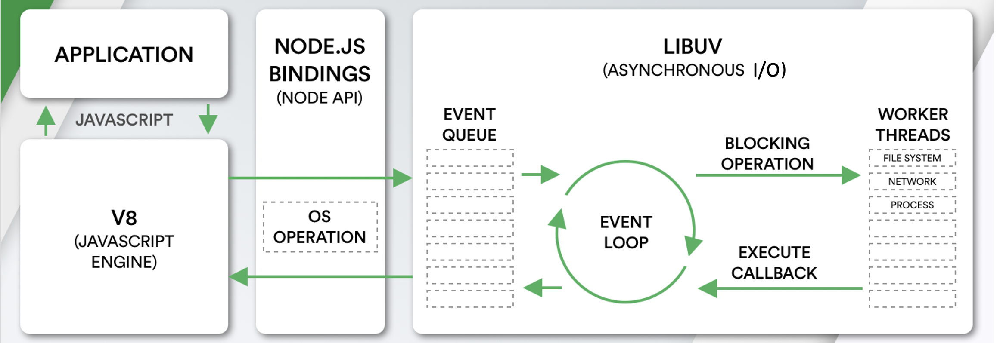
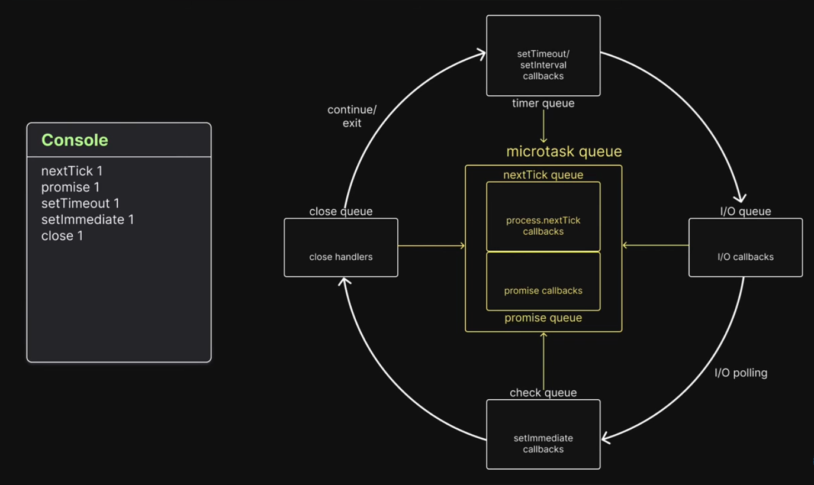
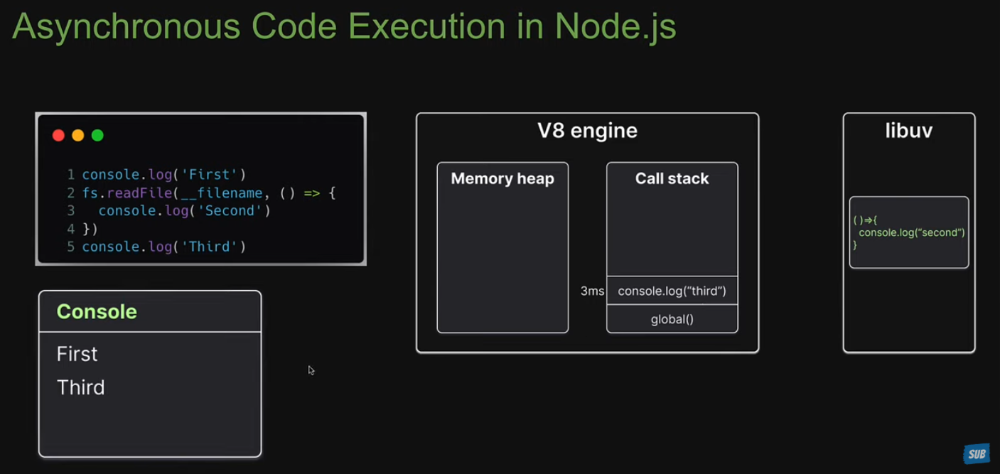
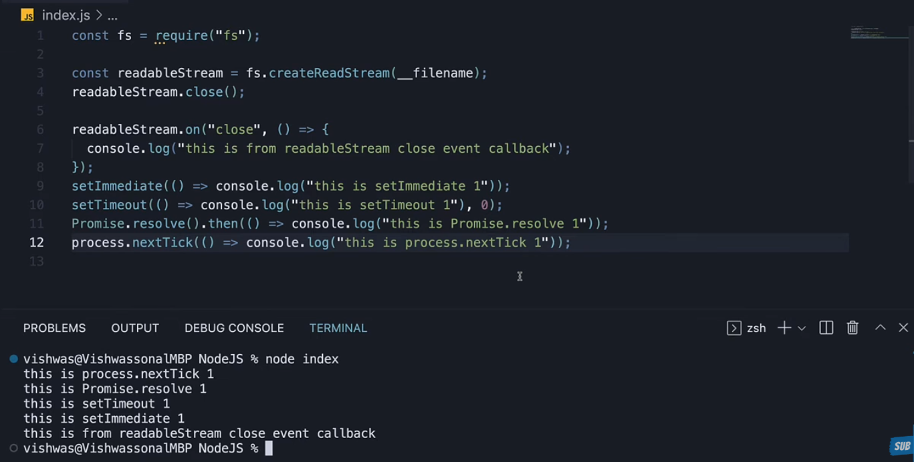

<!-- Start NodeJS -->

## **NodeJS**

<div align="right"><b><a href="../../README.md">↥ Back to home</a></b></div>

### Q 1. What is NodeJs?

Node.js is an open-source JavaScript runtime environment which is built on Chrome’s V8 engine. That uses a single-threaded, event-driven, non-blocking I/O model, where the event loop, powered by libuv, efficiently handles asynchronous operations. This architecture enables highly scalable server-side and real-time applications.

<!-- _Key features of NodeJs:_

1. **Asynchronous and Event-Driven:** Node.js uses a non-blocking, event-driven architecture, which allows it to handle multiple concurrent connections efficiently. This makes it suitable for building real-time applications like chat applications or streaming services.

2. **JavaScript Everywhere:** Node.js enables developers to use JavaScript for both client-side and server-side development, fostering code reuse, and reducing context switching between languages.

3. **V8 Engine:** Node.js is built on Chrome's V8 JavaScript engine, which compiles JavaScript code to native machine code, resulting in high performance and efficiency.

4. **Package Ecosystem (npm):** Node.js has a vast ecosystem of open-source libraries and packages available through npm (Node Package Manager). Developers can easily install and manage dependencies for their projects using npm.

5. **Single-Threaded, Event Loop:** Node.js operates on a single-threaded event loop model, where I/O operations are non-blocking and handled asynchronously. This allows Node.js to handle a large number of concurrent connections without the overhead of thread-based concurrency.

6. **Scalability:** Node.js applications can be easily scaled horizontally by adding more instances or vertically by utilizing more powerful hardware. It also supports clustering for leveraging multiple CPU cores.

Node.js is commonly used for building various types of applications, including web servers, RESTful APIs, real-time web applications, microservices, command-line tools, and more. Its lightweight, efficient, and scalable nature makes it a popular choice for building modern web applications. -->

<div align="right"><b><a href="#nodejs">↥ Back to top</a></b></div>

### Q 2. How does NodeJs work?

<!-- Node.js works by running JavaScript on the server using the V8 engine. It follows a single-threaded, event-driven, non-blocking I/O model. When an asynchronous task is triggered, it is handled by libuv and the OS, and once completed, the event loop executes its callback. This allows Node.js to handle multiple requests efficiently and scale well for server-side applications. -->

Node.js is single-threaded, event-driven, non-blocking I/O model.

A new request coming in is one kind of event. The server starts processing it and when there is a blocking IO operation, it does not wait until it completes and instead registers a callback function. The server then immediately starts to process another event ( maybe another request ). When the IO operation is finished, that is another kind of event, and the server will process it ( i.e. continue working on the request ) by executing the callback as soon as it has time.

Node.js Platform does not follow Request/Response Multi-Threaded Stateless Model. It follows Single Threaded with Event Loop Model. Node.js Processing model mainly based on Javascript Event based model with Javascript callback mechanism.



<div align="right"><b><a href="#nodejs">↥ Back to top</a></b></div>

### Q 3. Create a simple server?

Step 1: Initialize project and Install ExpressJS

```js
  npm init -y
  npm install express
```

Step 2: Now create a file `server.js`

```js
const express = require("express");
const app = express();

const PORT = 3000;

// Basic route
app.get("/", (req, res) => {
  res.send("Hello, World!");
});

// Start server
app.listen(PORT, () => {
  console.log(`Server is running on http://localhost:${PORT}`);
});
```

Step 4: Run the app

```js
  node app.js
```

<div align="right"><b><a href="#nodejs">↥ Back to top</a></b></div>

### Q 4. What are some commonly used timing features of Node.js?

**1️⃣ `setTimeout()`:** Executes a callback after a minimum delay (exact timing is not guaranteed). Runs in the Timers phase of the event loop.

```js
setTimeout(() => {
  console.log("Runs after ~1000ms");
}, 1000);
```

**2️⃣ `setInterval()`:** Executes a callback repeatedly at a fixed interval. Also runs in the Timers phase.

```js
setInterval(() => {
  console.log("Runs every 2 seconds");
}, 2000);
```

**3️⃣ `setImmediate()`:** Executes a callback after the current I/O cycle completes. Runs in the Check phase.

```js
setImmediate(() => {
  console.log("Runs in check phase");
});
```

**4️⃣ `process.nextTick()`:** Executes a callback immediately after the current operation, before the event loop continues, and before Promises. Runs in the microtask queue.

```js
process.nextTick(() => {
  console.log("Runs before next event loop phase");
});
```

| Timing Feature                           | When to Use                                                                          | Real-World Example                                          | Event Loop Phase |
| ---------------------------------------- | ------------------------------------------------------------------------------------ | ----------------------------------------------------------- | ---------------- |
| `setTimeout()`                           | Delay a task                                                                         | Retry an HTTP request after 2 seconds if it fails           | Timers           |
| `setInterval()`                          | Run recurring tasks                                                                  | Poll a database every 5 minutes for updates                 | Timers           |
| `setImmediate()`                         | Defer until after current I/O                                                        | Log request metrics right after handling an HTTP request    | Check            |
| `process.nextTick()`                     | Run immediately after current operation                                              | Validate input or update internal state before continuing   | Microtask queue  |
| `Promise.then()` / async                 | Run lightweight async tasks after current operation but before next event loop phase | Update cache or internal counters after an async operation  | Microtask queue  |
| `timers/promises` (`await setTimeout()`) | Async/await-friendly delays                                                          | Wait before retrying a failed API call in an async function | Timers           |

<div align="right"><b><a href="#nodejs">↥ Back to top</a></b></div>

### Q 5. What is the difference between process.nextTick() and setImmediate()?

| Feature                | `process.nextTick()`            | `setImmediate()`                     |
| ---------------------- | ------------------------------- | ------------------------------------ |
| Execution timing       | Before the event loop continues | On the next event loop iteration     |
| Priority               | Very high                       | Lower than nextTick                  |
| Use case               | Defer execution but run ASAP    | Defer execution without blocking I/O |
| Can starve event loop? | Yes, if abused                  | No                                   |

<div align="right"><b><a href="#nodejs">↥ Back to top</a></b></div>

### Q 6. What is EventEmitter and how does it works?

The EventEmitter is a class that provides communication/interaction between objects in Node.js. That allows objects to emit events and listen for events.

**How EventEmitter works**

- Event Emitter emits the data in an event called message
- A Listened is registered on the event message
- when the message event emits some data, the listener will get the data

**Building Blocks:**

- `.emit()` - This method in event emitter is to emit an event in module
- `.on()` - This method is to listen to data on a registered event in node.js
- `.once()` - It listen to data on a registered event only once.
- `.addListener()` - it checks if the listener is registered for an event.
- `.removeListener()` - It removes the listener for an event.

**Example 1: Basic EventEmitter**

```js
const EventEmitter = require("events");
const myEmitter = new EventEmitter();

// Add listener
myEmitter.on("greet", () => {
  console.log("Hello World!");
});

// Emit event
myEmitter.emit("greet"); // Output: Hello World!
```

**Example 2: Real use case**

```js
const EventEmitter = require("events");

class ChatApp extends EventEmitter {}

const chat = new ChatApp();

// Listener for new message
chat.on("message", (from, to, text) => {
  console.log(`[Message] ${from} → ${to}: ${text}`);
});

// Listener for user login
chat.on("login", (username) => {
  console.log(`[Login] ${username} joined the chat`);
});

// Listener for user logout
chat.on("logout", (username) => {
  console.log(`[Logout] ${username} left the chat`);
});

// Simulate events
chat.emit("login", "Alice");
chat.emit("login", "Bob");

chat.emit("message", "Alice", "Bob", "Hi Bob!");
chat.emit("message", "Bob", "Alice", "Hello Alice!");

chat.emit("logout", "Alice");
chat.emit("logout", "Bob");
```

<div align="right"><b><a href="#nodejs">↥ Back to top</a></b></div>

### Q 8. What is the event loop in Node.js, and how is it handled in depth?

Event-loop is a mechanism that handles asynchronous operations by contenous checking in the call stack and the task queue. When the call stack is empty, it pushes the tasks from the task queue to the call stack, enabling non-blocking, asynchronous execution.



Now we’ll explain the Node.js event loop strictly phase-by-phase, exactly in this order:

1. Run Synchronous Code
2. Run Microtasks (nextTick → Promises)
3. Timer Queue (Timers Phase)
4. I/O Queue (Pending Callbacks)
5. I/O Polling (Poll Phase)
6. Check Phase (setImmediate)
7. Close Queue

**1️⃣ Synchronous Code (Before Event Loop Starts)**

**✅ What Runs Here**

- All normal JavaScript execution
- `console.log`
- Variable declarations
- Function calls
- Blocking operations
- `fs.readFileSync()`
- `JSON.parse()` (large payloads)

**Also during this stage:**

- Async APIs are registered
- Timers are scheduled
- Promises are created

**2️⃣ Important: Microtasks (Runs Between Phases)**

_After every phase, Node executes:_

- `process.nextTick()` callbacks
- Promise `.then()` callbacks

> ⚠️ Overusing nextTick() can starve I/O.

**3️⃣ Timer Queue (Timers Phase)**

**✅ What Runs Here**

- `setTimeout()`
- `setInterval()`

**⚠️ Pitfalls**

- 0ms does NOT mean immediate — it means: "Run in the timers phase when delay has expired
- Assuming exact timing (Node doesn’t guarantee precision)

**4️⃣ I/O Queue (Pending Callbacks Phase)**

**✅ What Runs Here**

- Some TCP errors
- Certain system-level I/O callbacks
- Deferred I/O from previous loop

**⚠️ Pitfalls**

- This is NOT where normal file read callbacks run — those go to Poll phase.
- Hard to predict ordering
- Network error callbacks may appear here

**5️⃣ I/O Polling (Poll Phase)** This is the most important phase.

**✅ What Runs Here**

- `fs.readFile()`
- Database callbacks
- Network responses
- HTTP request handlers
- Most async I/O

**The poll phase:**

- Waits for I/O to complete
- Executes I/O callbacks
- May block waiting for events (if no timers exist)

**6️⃣ Check Phase**

_✅ What Runs Here_

- setImmediate()

_Runs after Poll phase completes._

**Important:** Inside an I/O callback → `setImmediate()` runs before `setTimeout()`.

**⚠️ Pitfalls**

- Confusion between `setTimeout(0)` and `setImmediate()`
- Overusing `setImmediate` unnecessarily

**7️⃣ Close Queue (Close Callbacks Phase)** Final phase of the loop.

**✅ What Runs Here**

- socket.on("close")
- stream.on("close")
- server.on("close")

_Runs when resource is fully closed._

**⚠️ Pitfalls**

- Forgetting cleanup logic
- Memory leaks if resources not properly closed
- Assuming close runs immediately

**🎯 Interview-Ready 3-Line Answer**

Node first runs synchronous code, then microtasks (nextTick before Promises).
After that, event loop phases execute in order: Timers → I/O pending → Poll → Check → Close.
Blocking code in any phase can delay the entire loop and hurt performance.

_Repeat until empty._

<details>
<summary>Click to view the images</summary>





</details><br>

<details>
<summary>🔥 Tricky Interview Question with deep explanation</summary>

```js
const fs = require("fs");

console.log("start");

setTimeout(() => {
  console.log("timeout");
}, 0);

setImmediate(() => {
  console.log("immediate");
});

fs.readFile(__filename, () => {
  console.log("file read");
});

process.nextTick(() => {
  console.log("nextTick");
});

Promise.resolve().then(() => {
  console.log("promise");
});

console.log("end");
```

**Output**

```js
start
end
nextTick
promise
timeout
immediate
file read
```

### 🔍 Full Breakdown (Event Loop + libuv)

We are running in Node.js.

**1️⃣ Synchronous Code Runs First**

```js
start;
end;
```

**2️⃣ Microtasks Run** - Node has two microtask queues:

1. `process.nextTick()` (higher priority) runs before Promises in Node.
2. Promise queue

```js
nextTick;
promise;
```

**3️⃣ Now the Event Loop Starts**

- Timers Phase

  `setTimeout(..., 0)` goes here.

  ```js
  timeout;
  ```

- Poll Phase

  This is where I/O callbacks run.

  `fs.readFile()` is handled by libuv thread pool.

  _Here’s the key:_
  - fs.readFile is delegated to libuv.
  - libuv uses its thread pool.
  - When finished, callback is queued in the poll phase.

  But depending on timing, the poll phase might not execute it immediately.

- Check Phase

  `setImmediate()` runs here.

  ```js
  immediate;
  ```

- File Read Callback

  When the file read completes, it gets executed in the poll phase:

  ```js
  file read
  ```

**🚨 The Real Trick**

If you move `setImmediate()` inside `fs.readFile()` like this:

```js
fs.readFile(__filename, () => {
  setTimeout(() => console.log("timeout"), 0);
  setImmediate(() => console.log("immediate"));
});
```

Now the output order becomes predictable:

```js
immediate;
timeout;
```

_Why?_

Because when inside an I/O cycle:

- Poll phase finishes
- Then Check phase runs (setImmediate)
- Then next loop → Timers phase (setTimeout)

> This is a VERY common senior interview trick.

**🧩 Where libuv Comes In**

Here’s what many candidates miss:

- fs.readFile() is NOT handled by JavaScript.
- It goes to libuv’s thread pool.
- When finished, libuv pushes callback to poll queue.
- Event loop executes it in the poll phase.

Without libuv, Node could not do async file reading.

So the interaction is:

> **JavaScript → libuv → OS/thread pool → callback → event loop → execution**

**💥 Performance Insight**

If you have any block level code then the event loop cannot move while the call stack is busy. That’s why CPU-heavy work breaks Node performance.

</details>

<div align="right"><b><a href="#nodejs">↥ Back to top</a></b></div>

### Q 9. What libuv?

libuv is a C library used by Node.js to handle asynchronous I/O operations and implement the event loop. It interacts with the OS (operating system) and manages a thread pool for tasks like file system access and networking. It plays a role similar to Web APIs in the browser, but it’s a lower-level system library used in server-side environments.

<div align="right"><b><a href="#nodejs">↥ Back to top</a></b></div>

### Q 1. What is a Callback Function?

A callback function is a function passed as an argument to another function and is executed later after a task is completed.

In Node.js, callbacks are mainly used for handling asynchronous operations, like reading files, querying databases, or making HTTP requests.

**Example 1: Simple Callback**

```js
function greet(name, callback) {
  console.log(`Hello, ${name}`);
  callback();
}

function sayGoodbye() {
  console.log("Goodbye!");
}

greet("Alice", sayGoodbye);

// Hello, Alice
// Goodbye!
```

**Example 2: Async Callback with File Read**

```js
const fs = require("fs");

fs.readFile("example.txt", "utf8", (err, data) => {
  if (err) {
    console.error("Error reading file:", err);
    return;
  }
  console.log("File content:", data);
});
```

**Key Points**

- Callbacks enable async programming in Node.js.
- They often follow the error-first pattern: (err, result) => { ... }.
- Using too many nested callbacks can lead to “callback hell”, which is solved by Promises or async/await.

<div align="right"><b><a href="#nodejs">↥ Back to top</a></b></div>

### Q 1. What is an error-first callback?

An error-first callback is a standard pattern in Node.js for handling `asynchronous` operations.

- The first argument is always reserved for an error (if any occurred).
- The second argument (and others) contains the result of the operation.
- This makes it easy to check for errors before using the data.

**Example 1: Reading a file**

```js
const fs = require("fs");

fs.readFile("example.txt", "utf8", (err, data) => {
  if (err) {
    console.error("Error reading file:", err);
    return; // stop execution if error
  }
  console.log("File content:", data);
});
```

> ✅ Here, err is the first argument, and data is the second argument.

**Example 2: Custom function with error-first callback**

```js
function divide(a, b, callback) {
  if (b === 0) {
    callback(new Error("Division by zero")); // send error
  } else {
    callback(null, a / b); // no error, send result
  }
}

divide(10, 2, (err, result) => {
  if (err) {
    console.error("Error:", err.message);
    return;
  }
  console.log("Result:", result);
});

Output:
a = 2, b = 3
Result: 5

a = 2, b = 0
Error: Division by zero
```

<div align="right"><b><a href="#nodejs">↥ Back to top</a></b></div>

### Q 1. What is a callback hell and how to avoid it?

Callback Hell happens when you have multiple nested callbacks which makes code hard to read and debug when dealing with asynchronous logic. The callback hell usually looks like a pyramid of doom.

_**Example:**_

```javascript
// Example 1:
async1(function(){
    async2(function(){
        async3(function(){
            async4(function(){
                ....
            });
        });
    });
});

// Example 2:
doSomething(function(err, result1) {
    if (err) throw err;
    doSomethingElse(result1, function(err, result2) {
        if (err) throw err;
        doAnotherThing(result2, function(err, result3) {
            if (err) throw err;
            finalTask(result3, function(err, result4) {
                if (err) throw err;
                console.log('All tasks completed:', result4);
            });
        });
    });
});
```

**Ways to Avoid Callback Hell:**

- **Using Promises**.

  ```js
  doSomething()
    .then((result1) => doSomethingElse(result1))
    .then((result2) => doAnotherThing(result2))
    .then((result3) => finalTask(result3))
    .then((result4) => {
      console.log("All tasks completed:", result4);
    })
    .catch((err) => {
      console.error("Error:", err);
    });
  ```

- **Using async/await**

  ```js
  async function main() {
    try {
      const result1 = await doSomething();
      const result2 = await doSomethingElse(result1);
      const result3 = await doAnotherThing(result2);
      const result4 = await finalTask(result3);

      console.log("All tasks completed:", result4);
    } catch (err) {
      console.error("Error:", err);
    }
  }

  main();
  ```

<div align="right"><b><a href="#nodejs">↥ Back to top</a></b></div>

### Q 1. What is streams and how many types are there?

Streams are objects that let you read or write data piece by piece. There are four types of streams

**Types of Streams**

| Type          | Description                                                            | Example                            |
| ------------- | ---------------------------------------------------------------------- | ---------------------------------- |
| **Readable**  | Used to **read data** from a source                                    | `fs.createReadStream('file.txt')`  |
| **Writable**  | Used to **write data** to a destination                                | `fs.createWriteStream('file.txt')` |
| **Duplex**    | Can **read and write** data                                            | `net.Socket`                       |
| **Transform** | A special duplex stream that can **modify data while reading/writing** | `zlib.createGzip()`                |

**Common Event Methods for All Streams**

| Event    | Description                                                   |
| -------- | ------------------------------------------------------------- |
| `data`   | Emitted when a chunk of data is available (readable streams). |
| `end`    | Emitted when there is no more data to read.                   |
| `finish` | Emitted when all data has been flushed (writable streams).    |
| `error`  | Emitted when an error occurs.                                 |
| `close`  | Emitted when the stream is fully closed.                      |

**Example 1: Readable Stream**

```js
const fs = require("fs");

const readStream = fs.createReadStream("input.txt", "utf8");

readStream.on("data", (chunk) => {
  console.log("Received chunk:", chunk);
});

readStream.on("end", () => {
  console.log("Finished reading file");
});
```

**Example 2: Writable Stream**

```js
const fs = require("fs");

const writeStream = fs.createWriteStream("output.txt");

writeStream.write("Hello ");
writeStream.write("World!");
writeStream.end(() => {
  console.log("Finished writing file");
});
```

**Example 3: Duplex / Transform Stream (Pipe Example)**

```js
const fs = require("fs");
const zlib = require("zlib");

// Read file -> Compress -> Write file
const readStream = fs.createReadStream("input.txt");
const writeStream = fs.createWriteStream("input.txt.gz");
const gzip = zlib.createGzip();

readStream.pipe(gzip).pipe(writeStream);

writeStream.on("finish", () => {
  console.log("File compressed successfully");
});
```

<div align="right"><b><a href="#nodejs">↥ Back to top</a></b></div>

### Q 1. What is `spawn()` and `fork()` and difference?

**`spawn()`:** It is a method in Node.js’s child_process module. It is used to creates a child process to run any OS command and streams output via `stdout`/`stderr`

**Example:**

```js
const { spawn } = require("child_process");

// Run the 'ls' command (list files in current directory)
const ls = spawn("ls", ["-l"]);

ls.stdout.on("data", (data) => {
  console.log(`Output:\n${data}`);
});

ls.stderr.on("data", (err) => {
  console.error(`Error: ${err}`);
});

ls.on("close", (code) => {
  console.log(`Child process exited with code ${code}`);
});
```

**`fork()`:** It is a special case of `spawn()` used only to create Node.js child processes with a built-in IPC channel for parent-child communication. Used when you want multiple Node.js scripts to run in parallel and communicate.

**Example:**

```js
//child.js

process.on("message", (msg) => {
  console.log("Child received:", msg);
  process.send(`Hello from child!`);
});

//parent.js

const { fork } = require("child_process");
const child = fork("child.js");

child.on("message", (msg) => {
  console.log("Parent received:", msg);
});

child.send("Hello from parent!");
```

**Key Differences Between spawn() and fork()**
| Feature | `spawn()` | `fork()` |
| ------------- | -------------------------------------- | ------------------------------------------------- |
| Purpose | Run **any command** as child process | Run **Node.js scripts** as child process |
| Communication | Uses **stdout/stderr streams** | Built-in **IPC channel** (`send` / `message`) |
| Usage | `spawn(command, args, options)` | `fork(modulePath, args, options)` |
| Return Type | ChildProcess object | ChildProcess object with **IPC support** |
| Suitable for | Long-running processes, shell commands | Parallel Node.js scripts that need to communicate |

<div align="right"><b><a href="#nodejs">↥ Back to top</a></b></div>

### Q 1. What is load balancer and how it works?

A load balancer distributes incoming client requests across multiple servers to improve: Performance, Availability & Scalability.

It sits between the client and the backend servers and forwards requests using algorithms like Round Robin, Least Connections.

**How Does a Load Balancer Work?**

- Client sends request.
- Load balancer receives the request.
- It selects a backend server using a load-balancing algorithm.
- The selected server processes the request.
- Response goes back to the client through the load balancer.

**1️⃣ Load Balancing using Cluster (Built-in Node.js):** NodeJS has a built-in module called Cluster Module. It creates multiple worker processes that share the same server port. Requests are distributed using round-robin (default). Uses multiple CPU cores.

> 🔄 **Flow:** Client → Master Process → Worker 1 / Worker 2 / Worker 3

**Example using Cluster**

```js
const cluster = require("cluster");
const http = require("http");
const os = require("os");

if (cluster.isMaster) {
  const cpuCount = os.cpus().length;

  for (let i = 0; i < cpuCount; i++) {
    cluster.fork(); // create workers
  }
} else {
  http
    .createServer((req, res) => {
      res.end(`Handled by process: ${process.pid}`);
    })
    .listen(3000);
}
```

**2️⃣ Load Balancing using PM2:** PM2 is a production process manager with built-in cluster mode. It allows you to keep applications alive forever. Automatically balances load, Restarts crashed processes and Zero-downtime reload.

```js
pm2 start app.js -i max
```

`-i max` → Runs app on all CPU cores.

**Common Load Balancing Algorithms**

- Round Robin(Default) – Requests are distributed one by one in order.
- Least Connections – Sends request to the server with fewer active connections.
- IP Hash – Uses client IP to decide which server handles the request.

**🔹 Simple Real-World Example**

Imagine your server has 4 CPU cores.

- Without Cluster/PM2:
  - Only 1 core works ❌
  - Other 3 cores idle
- With Cluster or PM2:
  - All 4 cores handle requests ✅
  - Faster response
  - Better performance

> 🔹 Important Note

This is load balancing inside one server (process-level load balancing).
For balancing across multiple servers, you need tools like Nginx or cloud load balancers.

- Cluster and PM2 provide load balancing inside a single server (process-level).
- For load balancing across multiple servers, we required tools like: Nginx or Cloud Load Balancers (AWS ELB, etc.).

<div align="right"><b><a href="#nodejs">↥ Back to top</a></b></div>

### Q 1. Difference Between Cluster and PM2?

| Feature          | Cluster                 | PM2                       |
| ---------------- | ----------------------- | ------------------------- |
| Type             | Node.js built-in module | External process manager  |
| Setup            | Manual coding required  | Simple CLI commands       |
| Auto restart     | No (manual handling)    | Yes                       |
| Monitoring       | Basic                   | Advanced dashboard & logs |
| Production ready | Needs setup             | Yes                       |

<div align="right"><b><a href="#nodejs">↥ Back to top</a></b></div>

### Q 1. What is middleware?

Middleware is a function that runs between the request and response cycle. It can modify the request/response, execute logic, or end the request. It uses the next() function to pass control to the next middleware.

**Example:**

```js
const express = require("express");
const app = express();

// Custom middleware
app.use((req, res, next) => {
  console.log("Request received at:", new Date());
  next(); // pass control to next middleware
});

app.get("/", (req, res) => {
  res.send("Hello World");
});

app.listen(3000);

// Here:
// Middleware logs the request
// next() moves control to the route handler
```

**🔹 Types of Middleware**

- Application-level middleware
- Router-level middleware
- Error-handling middleware
- Built-in middleware (e.g., express.json())

<div align="right"><b><a href="#nodejs">↥ Back to top</a></b></div>

### Q 1. What are the security mechanisms available in Node.js?

**1️⃣ Authentication & Authorization**

- What it protects against:
  - Unauthorized access
  - Privilege escalation
- Common methods:
  - JWT (JSON Web Token)
  - OAuth
  - Sessions
  - Role-based access control (RBAC)

**Example (JWT Authentication Middleware)**

```js
const jwt = require("jsonwebtoken");

function authMiddleware(req, res, next) {
  const token = req.headers.authorization;

  if (!token) {
    return res.status(401).json({ message: "Unauthorized" });
  }

  try {
    const decoded = jwt.verify(token, "secretKey");
    req.user = decoded;
    next();
  } catch (err) {
    return res.status(403).json({ message: "Invalid token" });
  }
}
```

**2️⃣ Input Validation & Sanitization**

- What it protects against:
  - SQL Injection
  - NoSQL Injection
  - XSS attacks

**Example using validation:**

```js
const { body, validationResult } = require("express-validator");

app.post("/user", body("email").isEmail(), (req, res) => {
  const errors = validationResult(req);
  if (!errors.isEmpty()) {
    return res.status(400).json({ errors: errors.array() });
  }
  res.send("Valid input");
});
```

Never trust user input.

**3️⃣ HTTP Security Headers (Helmet):** This automatically sets secure HTTP headers.

- Prevents:
  - Clickjacking
  - XSS
  - MIME sniffing
  - Content injection

**Example:**

```js
const helmet = require("helmet");
app.use(helmet());
```

**4️⃣ Protection Against Common Attacks**

**🔹 CORS Protection** Prevents unauthorized cross-origin requests.

```js
const cors = require("cors");
app.use(cors({ origin: "https://yourdomain.com" }));
```

**🔹 Rate Limiting (Prevent Brute Force & DDoS)** Limits repeated requests.

```js
const rateLimit = require("express-rate-limit");

const limiter = rateLimit({
  windowMs: 15 * 60 * 1000,
  max: 100,
});

app.use(limiter);
```

**5️⃣ Secure Communication (HTTPS / TLS)**

Use HTTPS instead of HTTP:

```js
const https = require("https");
const fs = require("fs");

https
  .createServer(
    {
      key: fs.readFileSync("key.pem"),
      cert: fs.readFileSync("cert.pem"),
    },
    app,
  )
  .listen(443);
```

**6️⃣ Environment Variable Security**

Never store secrets in code:

```js
require("dotenv").config();
const dbPassword = process.env.DB_PASSWORD;
```

<div align="right"><b><a href="#nodejs">↥ Back to top</a></b></div>

### Q 1. Explain the terms body-parser, cookie-parser, morgan, nodemon, pm2, serve-favicon, cors, dotenv, fs-extra, moment in Express.js??

**1️⃣ body-parser:** Parses incoming request bodies so you can access req.body.

**Used for:**

- JSON data
- Form data

> ⚠️ Note: In modern Express (v4.16+), express.json() replaces body-parser.

**Example:**

```js
app.use(express.json());
app.use(express.urlencoded({ extended: true }));
```

> ⚠️ Note: Without this, req.body will be undefined.

**2️⃣ cookie-parser:** Parses cookies from incoming requests and makes them available in req.cookies.

**Used for:**

- Session management
- Authentication tokens

**Example:**

```js
const cookieParser = require("cookie-parser");
app.use(cookieParser());

app.get("/", (req, res) => {
  console.log(req.cookies);
});
```

**3️⃣ morgan:** HTTP request logger middleware.

**Used for:**

- Logging request method
- URL
- Status code
- Response time

**Example:**

```js
const morgan = require("morgan");
app.use(morgan("dev"));
```

Very useful in development & monitoring.

**4️⃣ nodemon:** Automatically restarts your server when file changes are detected.

Used in development only.

```js
nodemon app.js
```

**5️⃣ PM2:** Production process manager for Node.js.

**Features:**

- Cluster mode
- Auto restart
- Monitoring
- Zero downtime reload

```js
pm2 start app.js -i max
```

**6️⃣ serve-favicon:** Serves favicon efficiently. Prevents unnecessary repeated favicon requests.

**Example:**

```js
const favicon = require("serve-favicon");
app.use(favicon(\_\_dirname + "/public/favicon.ico"));
```

**7️⃣ cors:** Enables Cross-Origin Resource Sharing. Prevents frontend-backend origin blocking issues.

**Example:**

```js
const cors = require("cors");
app.use(cors());
```

Used when frontend & backend run on different domains/ports.

**8️⃣ dotenv:** Loads environment variables from .env file into process.env.

**Used for:**

- Database credentials
- API keys
- Secrets
- Never hardcode secrets.

**Example:**

```js
require("dotenv").config();
console.log(process.env.DB_PASSWORD);
```

**9️⃣ fs-extra** Enhanced version of Node’s built-in fs module.

**Adds:**

- Promise support
- Extra methods like `copy`, `move`, `remove`

**Example:**

```js
const fs = require("fs-extra");
await fs.copy("source.txt", "dest.txt");
```

Cleaner and easier than native fs.

**🔟 moment:** Date and time formatting library.

**Example:**

```js
const moment = require("moment");
console.log(moment().format("YYYY-MM-DD"));
```

> ⚠️ Note: Moment is now considered legacy. Modern alternatives:

- Day.js
- date-fns
- Native Intl

<div align="right"><b><a href="#nodejs">↥ Back to top</a></b></div>

### Q 1. What are RESTful Web Services?

RESTful web services in Node.js are APIs that follow REST principles using resource-based URLs and standard HTTP methods like GET, POST, PUT, and DELETE. They are stateless and typically return JSON responses with proper HTTP status codes.

**HTTP methods:**

- `GET` → Used to retrieve data.
- `POST` → Used to create new data.
- `PUT` → Used to update/replace existing data completely.
- `PATCH` → Used to partial update of existing data.
- `DELETE` → Used to remove data.

**Uses Standard HTTP Status Codes**

- 200 → OK
- 201 → Created
- 400 → Bad Request
- 401 → Unauthorized
- 404 → Not Found
- 500 → Server Error

> Note: PATCH is used to partially update a resource, while PUT replaces the entire resource.

**🔹 Example: Simple REST API in Node.js (Express)**

```js
const express = require("express");
const app = express();

app.use(express.json());

let users = [];

// GET - Read
app.get("/users", (req, res) => {
  res.status(200).json(users);
});

// POST - Create
app.post("/users", (req, res) => {
  const user = req.body;
  users.push(user);
  res.status(201).json(user);
});

// PUT - Update (Replace Entire Object)
app.put("/users/:id", (req, res) => {
  const id = req.params.id;

  if (!users[id]) {
    return res.status(404).json({ message: "User not found" });
  }

  users[id] = req.body;
  res.status(200).json(users[id]);
});

// PATCH - Partial Update
app.patch("/users/:id", (req, res) => {
  const id = req.params.id;

  if (!users[id]) {
    return res.status(404).json({ message: "User not found" });
  }

  // Merge existing user with new fields
  users[id] = { ...users[id], ...req.body };

  res.status(200).json(users[id]);
});

// DELETE - Remove
app.delete("/users/:id", (req, res) => {
  if (!users[req.params.id]) {
    return res.status(404).json({ message: "User not found" });
  }

  users.splice(req.params.id, 1);
  res.status(200).json({ message: "Deleted" });
});

app.listen(3000);
```

**Comparison**

| Method | Purpose           | Sends Data in Body? | Idempotent? | Example              |
| ------ | ----------------- | ------------------- | ----------- | -------------------- |
| GET    | Read data         | ❌ No               | ✅ Yes      | Get user list        |
| POST   | Create data       | ✅ Yes              | ❌ No       | Create new user      |
| PUT    | Replace full data | ✅ Yes              | ✅ Yes      | Replace user details |
| PATCH  | Partial update    | ✅ Yes              | ✅ Yes      | Update user email    |
| DELETE | Remove data       | ❌ Usually No       | ✅ Yes      | Delete user          |

**🔹 What is Idempotent?**

If you send the same request multiple times and the result remains the same → it is idempotent.

**Example:** DELETE user 5 → Even if you call it 5 times, result is same (user removed).

<div align="right"><b><a href="#nodejs">↥ Back to top</a></b></div>

### Q 1. Difference Between PUT and PATCH?

PUT replaces the entire resource on the server and requires the full payload. PATCH updates only specified fields and requires a partial payload. Use PUT for complete replacement and PATCH for partial modifications.

| Feature          | PUT                         | PATCH                      |
| ---------------- | --------------------------- | -------------------------- |
| Update Type      | Full resource replacement   | Partial update             |
| Payload Required | Full object                 | Only fields to update      |
| Idempotent       | Yes                         | Yes                        |
| Use Case         | Replace resource completely | Modify only certain fields |

<div align="right"><b><a href="#nodejs">↥ Back to top</a></b></div>

### Q 1. How many types of API functions are there?

There are two types of API functions in Node.js:

- Synchronous (Sync), Blocking functions API functions
  - These block the execution until the operation completes.
  - Example: fs.readFileSync()
- Asynchronous (Async), Non-blocking API functions
  - These don’t block the execution. They take a callback to handle the result when the operation completes.
  - Example: fs.readFile()

<div align="right"><b><a href="#nodejs">↥ Back to top</a></b></div>

### Q 1. What is the difference between req.params and req.query?

- `req.params` is used to get route parameters defined in the URL path, like `/users/:id`.
- `req.query` is used to get query string values after the `?`, like `/users?age=25`.
- Params identify a specific resource, while query is mainly used for filtering or searching.

**Example for `req.params`:**

```js
app.get("/users/:id", (req, res) => {
  console.log(req.params.id);
  res.send("User ID received");
});

// GET /users/10
// 10
```

**Example for `req.query`:**

```js
app.get("/users", (req, res) => {
  console.log(req.query.age);
  res.send("Query received");
});

// GET /users?age=25
// 25
```

**Comparison**

| Feature   | req.params        | req.query        |
| --------- | ----------------- | ---------------- |
| Location  | URL path          | After `?` in URL |
| Used For  | Specific resource | Filters/search   |
| Required? | Usually required  | Optional         |
| Example   | `/users/5`        | `/users?age=25`  |

<div align="right"><b><a href="#nodejs">↥ Back to top</a></b></div>

### Q 1. What is the difference between Asynchronous and Non-blocking?

Asynchronous means a task executes separately and completes later using callbacks or promises.
Non-blocking means the system does not stop execution while waiting for a task, especially I/O operations.
All non-blocking operations are asynchronous, but not all asynchronous operations are non-blocking.

**Example for Asynchronous:**

```js
setTimeout(() => {
  console.log("Done");
}, 2000);

console.log("Start");
```

**Example for Non-blocking:**

```js
const fs = require("fs");

fs.readFile("file.txt", "utf8", (err, data) => {
  console.log(data);
});

console.log("Reading file...");
```

<div align="right"><b><a href="#nodejs">↥ Back to top</a></b></div>

### Q 1. What?

<div align="right"><b><a href="#nodejs">↥ Back to top</a></b></div>

### Q 1. What?

<div align="right"><b><a href="#nodejs">↥ Back to top</a></b></div>

### Q 1. Redis, RabbitMQ and Kafka in Node.js?

<div align="right"><b><a href="#nodejs">↥ Back to top</a></b></div>

### Q 1. How to improve Node.js performance?

<div align="right"><b><a href="#nodejs">↥ Back to top</a></b></div>

### Q 1. How to use JSON Web Token (JWT) for authentication?

<div align="right"><b><a href="#nodejs">↥ Back to top</a></b></div>

### Q 1. How to build a microservices architecture with Node.js?

<div align="right"><b><a href="#nodejs">↥ Back to top</a></b></div>

### Q 1. How microservices communicate with each other?

<div align="right"><b><a href="#nodejs">↥ Back to top</a></b></div>

##
